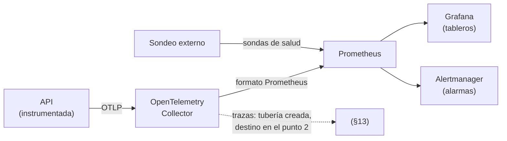
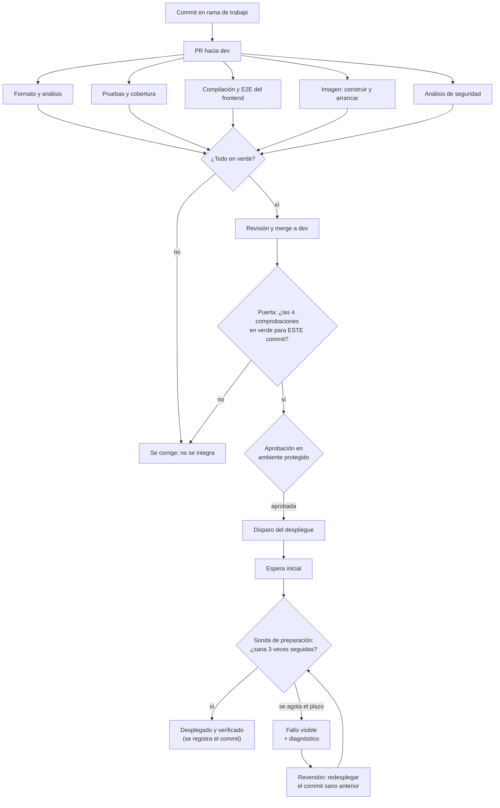

# Monitoreo de la aplicación: métricas, niveles de servicio y alertas

> **Caso de estudio de liberación y despliegue continuo** · Gestión de Servicios Profesionales
> **Fecha:** 2026-09-23 · **Rama de integración:** `dev` · **Spec:** [008](../specs/008-monitoreo-metricas-alertas/spec.md)
>
> Este documento describe y justifica el flujo de trabajo de liberación y despliegue continuo de la
> aplicación, el entorno requerido, los niveles de servicio acordados, las métricas establecidas
> para el monitoreo y los parámetros de configuración de las herramientas utilizadas.
>
> **Fuente de la versión en formato de documento.** El `.docx` entregable se genera desde este
> archivo con `docs/reporte/generar_monitoreo.py`; si ambos discrepan, manda este.

## Estado de lo descrito

El caso de estudio se divide en tres puntos. **Este documento desarrolla el punto 1.**

| Punto | Alcance | Estado |
|---|---|---|
| **1. Métricas para el monitoreo** | Recolección, tableros, niveles de servicio, alarmas y despliegue verificado | **Desarrollado aquí** |
| 2. Visor de trazabilidad | Registros y trazas | Reservado — §13 |
| 3. Visor de auditoría | Bitácora de acciones de usuario | Reservado — §14 |

Y dentro del punto 1, qué existe ya en el repositorio y qué es diseño aprobado pendiente de
construir. La distinción se mantiene en todo el documento: **lo que no está medido se dice que no
lo está.**

| Componente | Estado |
|---|---|
| Registros estructurados con correlación por identificador de traza | **En producción** (issue #124) |
| Instrumentación de métricas y trazas en la aplicación | **En producción**, sin consumidor (issue #124) |
| Sondas de vida y de preparación | **En producción** (issue #123) |
| Verificación de la imagen en integración continua | **En producción** (issue #131, primera mitad) |
| Entorno de monitoreo, tableros y alarmas | **Diseñado y aprobado**, pendiente de construir (issue #251) |
| Despliegue automatizado con verificación y reversión | **Diseñado y aprobado**, pendiente de construir (issues #251 y #189) |

---

## 1. Por qué esto, y por qué ahora

El sistema ya produce telemetría que nadie consume. La configuración de telemetría del backend
registra las métricas de la plataforma web y las exporta por OTLP **solo si** está definida la
variable que apunta al recolector. Esa variable está vacía desde que se escribió el código, porque
no existía recolector alguno al que apuntar. El resultado es que hoy la única manera de saber si la
aplicación funciona es abrirla en un navegador.

En paralelo, el despliegue se lanza a mano desde el panel del proveedor de alojamiento, la versión
en marcha no se puede ligar a un commit y no hay procedimiento de reversión. Los objetivos de
entrega que el proyecto se fijó en su estrategia de despliegue dicen literalmente «desconocido» y
«no se mide».

Son la misma carencia vista desde dos lados, y por eso se resuelven juntas: **un despliegue sin
verificación es una apuesta, y un monitoreo sin despliegue automatizado solo sirve para enterarse
tarde.**

---

## 2. Decisión estructural: dónde viven las métricas

La aplicación **no expone un endpoint de métricas**. Empuja su telemetría por OTLP a un
OpenTelemetry Collector, y es el colector quien la publica en el formato que el recolector entiende.



Tres razones, en orden de peso:

1. **El exportador que haría falta no tiene versión estable.** Consultado el 2026-09-23:
   `OpenTelemetry.Exporter.Prometheus.AspNetCore` va por `1.19.1-beta.1` y **nunca** ha publicado
   una versión estable; `OpenTelemetry.Instrumentation.EntityFrameworkCore`, por `1.19.0-beta.1`,
   tampoco. El proyecto compila tratando las advertencias como errores y prohíbe silenciarlas, así
   que no caben. El exportador OTLP, en cambio, es estable y **ya está instalado**.

   Esto corrige una suposición del issue #187, que aplazó las métricas «hasta que los paquetes
   salgan de preestreno» dando por hecho que era cuestión de tiempo. Año y medio después siguen ahí.

2. **Un endpoint de métricas en una API pública es superficie de información**: revela rutas,
   volúmenes de uso y versiones. Protegerlo exigiría autenticación propia o filtrado por red, que el
   proveedor actual no ofrece.

3. **El colector desacopla.** La aplicación empuja y no le importa quién consume. Sustituir el
   recolector por otro sistema no toca una línea de código.

La decisión se protege con una prueba de integración que afirma que la ruta `/metrics` responde
«no encontrado». Sin ella, alguien la añadiría más adelante sin advertir que contradice esto.

---

## 3. Estado de partida

| Aspecto | Antes de esta entrega |
|---|---|
| Registros | Estructurados en JSON, con identificador de traza y redacción de secretos |
| Trazas | Instrumentadas (plataforma web, cliente HTTP y controlador de base de datos), sin exportar |
| Métricas | Instrumentadas, **sin consumidor** |
| Tableros | No existen |
| Alarmas | No existen |
| Niveles de servicio | Solo un umbral de latencia, en las pruebas de carga |
| Despliegue | Manual, desde el panel del proveedor |
| Reversión | Sin procedimiento |
| Trazabilidad de la versión desplegada | Inexistente |

---

## 4. Flujo de trabajo del pipeline

### 4.1 El recorrido completo



### 4.2 Etapas

| Etapa | Herramienta | Disparador | Puerta | Estado |
|---|---|---|---|---|
| Integración: formato y análisis | GitHub Actions + CSharpier, StyleCop, Roslynator | PR y push | Cero advertencias | En uso |
| Integración: pruebas | GitHub Actions + xUnit, coverlet | PR y push | Suite en verde | En uso |
| Integración: frontend | GitHub Actions + Playwright | PR con cambios de frontend | Compilación y E2E en verde | En uso |
| Integración: imagen | GitHub Actions + Docker Buildx | PR y push | El contenedor arranca y responde sano | En uso |
| Seguridad | CodeQL + Dependabot | PR y semanal | Sin alertas nuevas | En uso |
| Pruebas de carga | GitHub Actions + k6 | Manual o por etiqueta | Percentil 95 bajo el umbral | En uso |
| Análisis estático | SonarQube local | Manual | Puerta de calidad sobre código nuevo | En uso |
| **Liberación** | GitHub Actions + disparador del proveedor | Imagen verificada sobre `dev` | Las cuatro comprobaciones en verde para ese commit | **Por construir** |
| **Despliegue** | Proveedor de alojamiento | Tras la aprobación | — | **Por construir** |
| **Verificación** | Sondeo de la sonda de preparación | Tras desplegar | Tres respuestas sanas consecutivas | **Por construir** |
| **Reversión** | El mismo flujo, con el commit anterior | Manual | La misma verificación | **Por construir** |

### 4.3 Por qué cada puerta está donde está

**Por qué el despliegue exige las cuatro comprobaciones y no solo la última.** Encadenar el
despliegue al flujo que construye la imagen demostraría únicamente que la imagen se construye. Un
commit con las pruebas en rojo pasaría. Por eso la puerta consulta el estado de las cuatro
comprobaciones **para ese commit concreto**, y no el resultado del flujo que la invocó.

**Por qué se sondea la sonda de preparación y no la de vida.** La de vida responde en cuanto el
proceso arranca. La de preparación, además, confirma que la base de datos es alcanzable, y por tanto
que las migraciones se aplicaron. Es la diferencia entre «el contenedor está encendido» y «el
sistema sirve». Esta misma decisión ya se tomó y documentó en la verificación de la imagen.

**Por qué hay una espera antes del primer sondeo.** Sin ella se sondearía la instancia **anterior**,
que responde perfectamente sana, y el despliegue se daría por bueno sin haber ocurrido. Es el modo
de fallo más probable de todo el diseño y el más difícil de detectar, porque produce un pipeline
verde.

**Por qué se exigen tres respuestas sanas consecutivas.** Durante un reinicio el servicio rebota:
puede responder sano un instante y caer de nuevo. Una sola respuesta no distingue «arrancó» de
«está arrancando».

**Por qué la concurrencia no cancela.** Dos despliegues simultáneos pueden ejecutar migraciones a la
vez. Se serializan por construcción, no por suerte.

**Por qué el plazo de verificación es largo.** El plan contratado duerme la instancia por
inactividad y además construye la imagen en su propia infraestructura. Un plazo corto reportaría
como fallo lo que es un arranque normal, y la primera consecuencia sería que alguien ampliara el
plazo sin entender por qué, o peor, que se desactivara la verificación.

**Por qué la reversión no es un flujo aparte.** Revertir es desplegar un commit anterior con la
misma verificación. Así el camino de reversión **se ejercita en cada despliegue**, en lugar de ser
una ruta que nadie ha recorrido hasta el día del incidente.

### 4.4 Límite conocido: qué significa «trazable» aquí

El disparador del proveedor hace que la plataforma **reconstruya** la imagen a partir del commit. La
imagen que llega a producción no es, por tanto, el mismo artefacto binario que se verificó en
integración continua, sino uno equivalente construido en otro sitio.

La trazabilidad que se obtiene es **commit → despliegue**, no **artefacto → despliegue**. Se acepta
porque el proveedor actual no permite desplegar una imagen externa sin reconfigurar el servicio
—trabajo que corresponde a la especificación de infraestructura como código— y porque la
verificación posterior sondea el servicio realmente desplegado, de modo que una imagen defectuosa se
detecta igual, aunque más tarde. Queda escrito para que nadie lea «inmutable por commit» en la
estrategia de despliegue y suponga algo más fuerte de lo que hay.

---

## 5. Entorno requerido

### 5.1 Entorno de ejecución de la aplicación

| Elemento | Valor |
|---|---|
| Alojamiento | Proveedor de contenedores, plan gratuito, detrás de una red de distribución |
| Imagen | Multietapa: compilación, paquete de migraciones y ejecución sobre la imagen de tiempo de ejecución de la plataforma |
| Puerto | 10000 |
| Base de datos | PostgreSQL 18 |
| Migraciones | Paquete autocontenido ejecutado al arrancar |
| Sonda del contenedor | Preparación, cada 30 s, con 60 s de gracia inicial |
| Cliente de base de datos en la imagen | Incluido, para los respaldos |
| Características del plan que condicionan el diseño | Memoria acotada y suspensión por inactividad, que provoca arranques en frío de decenas de segundos |

### 5.2 Entorno de monitoreo

Vive en su propio archivo de composición, **independiente del de la aplicación**. La razón es el
ciclo de vida: el monitoreo tiene que seguir en pie precisamente cuando la aplicación se cae, y si
compartieran proyecto, derribar la aplicación se llevaría por delante la evidencia del incidente.
Sigue el precedente que ya estableció el entorno de análisis estático.

| Servicio | Función | Puerto | Estado persistente |
|---|---|---|---|
| Colector de OpenTelemetry | Recibe OTLP y republica en formato del recolector | 4317, 4318, 8889 | No |
| Recolector de métricas | Almacena series, evalúa reglas, dispara alarmas | 9090 | Volumen nombrado |
| Gestor de alertas | Agrupa, silencia, inhibe y entrega | 9093 | Volumen nombrado |
| Tableros | Visualización | **3001** | Volumen nombrado |
| Sondeo externo | Observa las sondas de salud desde fuera | 9115 | No |

**El tablero se publica en 3001 y no en 3000** porque el frontend ocupa ese puerto. Es el tipo de
choque que cuesta media hora de diagnóstico la primera vez.

**Requisitos de la máquina:** Docker, unos 2 GB de memoria disponible para el conjunto, y **no
tener levantado a la vez el entorno de análisis estático**, que es igual de pesado.

### 5.3 Los dos alcances de observación

Es la limitación más importante de este diseño y conviene entenderla antes de leer las cifras:

| Alcance | Qué se observa | Cómo |
|---|---|---|
| **Entorno local** | Todo: latencia por ruta, memoria, recolección de basura, cola de hilos, métricas de negocio | La aplicación empuja telemetría al colector |
| **Servicio publicado** | Solo disponibilidad y tiempo de respuesta desde fuera | Sondeo externo de las sondas de salud |

El contenedor publicado **no puede** empujar telemetría a un colector que corre en el equipo de una
persona, y exponer ese colector a internet sería abrir un receptor público de telemetría. Por eso el
servicio real se observa desde fuera. A cambio, el sondeo externo da exactamente los dos datos que
hacen falta del entorno real: si está disponible y cuánto tarda en despertar.

---

## 6. Niveles de servicio acordados

**El arranque en frío se mide y se declara, pero no consume presupuesto de error.** Es una
característica conocida y aceptada del plan contratado, no un defecto del software. Confundir ambas
cosas llevaría a perseguir un objetivo que solo se alcanza pagando otro plan.

| ID | Indicador | Objetivo | Ventana | Consecuencia si se incumple |
|---|---|---|---|---|
| SLO-1 | Sondeos de la sonda de preparación con estado sano, excluidos los 90 s posteriores a un arranque en frío | ≥ 99,0 % | 30 días | Se abre incidencia; se evalúa un plan con instancia siempre activa |
| SLO-2 | Sondeos de la sonda de vida con estado sano | ≥ 99,5 % | 30 días | Investigación de reinicios: memoria o fallo de arranque |
| SLO-3 | Percentil 95 del tiempo de respuesta del servidor | ≤ 1,5 s (objetivo interno) · **≤ 5 s (acuerdo formal)** | 7 días | Por encima de 1,5 s, tarea de rendimiento; por encima de 5 s, incumplimiento que bloquea el siguiente despliegue |
| SLO-4 | Proporción de respuestas con error de servidor | ≤ 1 % (alarma al 5 %) | 7 días | La corrección tiene prioridad sobre cualquier funcionalidad nueva |
| SLO-5 | Duración del primer acceso tras inactividad | ≤ 90 s en el percentil 95 | 30 días | **Informativo.** Se declara para que no se confunda con una caída |
| SLO-6 | Tiempo con la aplicación despierta en que hay métricas disponibles | ≥ 99 % | 7 días | Se revisa el colector: sin métricas no hay ninguno de los objetivos anteriores |
| SLO-7 | Respaldos solicitados que terminan correctamente | 100 % | 30 días | Incidente crítico: afecta a la recuperabilidad |
| SLO-8 | Despliegues que quedan sanos a la primera | ≥ 95 % | 30 días o 20 despliegues | Se endurecen las puertas antes de seguir desplegando |
| SLO-9 | Tiempo desde detectar una versión defectuosa hasta servicio sano | ≤ 10 min | Por incidente | Se revisa el procedimiento de reversión |
| SLO-10 | Tiempo desde integrar hasta servicio sano verificado | ≤ 20 min | 30 días | Se recorta o paraleliza la etapa más lenta |

**SLO-3 hereda su techo de las pruebas de carga.** El proyecto ya fijó 5 s en el percentil 95 como
criterio de fallo de su plan de pruebas de carga. Declarar aquí un umbral distinto crearía dos
verdades sobre la misma magnitud, y la primera vez que discreparan nadie sabría cuál rige. El
objetivo interno más estricto existe porque 5 s ya es una experiencia mala: esperar a rozarlo para
reaccionar es llegar tarde.

**SLO-8, SLO-9 y SLO-10** ya estaban comprometidos en la estrategia de despliegue del proyecto como
métricas de entrega. Hasta ahora no tenían **de dónde** medirse; el flujo de despliegue verificado es
esa fuente.

**El reloj de SLO-10 no incluye la espera de aprobación humana.** Si la incluyera, mediría la
disponibilidad del revisor en lugar del pipeline.

---

## 7. Métricas establecidas para el monitoreo

### 7.1 Cómo se leen los nombres

La traducción la hace el colector y es mecánica: los puntos pasan a guiones bajos, se añade el
sufijo de la unidad y los contadores reciben `_total`. Un histograma produce tres series: los
tramos, la suma y el conteo.

```
http.server.request.duration  →  http_server_request_duration_seconds_bucket
                                 http_server_request_duration_seconds_sum
                                 http_server_request_duration_seconds_count
```

### 7.2 Peticiones y servidor

Ya se emiten hoy; lo único que faltaba era alguien que las consumiera.

| Métrica | Tipo | Para qué sirve |
|---|---|---|
| `http_server_request_duration_seconds` | Histograma | **La métrica central.** De ella salen la latencia p95 (SLO-3), la proporción de errores (SLO-4) y el volumen de peticiones |
| `http_server_active_requests` | Contador bidireccional | Peticiones en vuelo: saturación instantánea |
| `kestrel_active_connections` | Contador bidireccional | Conexiones abiertas, haya o no petición en curso |
| `kestrel_queued_requests` | Contador bidireccional | Trabajo aceptado y aún no atendido |
| `kestrel_rejected_connections_total` | Contador | Se alcanzó el límite de conexiones: saturación dura |
| `aspnetcore_routing_match_attempts_total` | Contador | Tráfico hacia rutas inexistentes: rastreo o escaneo |
| `aspnetcore_diagnostics_exceptions_total` | Contador | Excepciones no controladas |
| `aspnetcore_rate_limiting_requests_total` | Contador | **Rechazos del limitador de autenticación** |

La última exige registrar su medidor **explícitamente**: no viaja con la instrumentación general de
la plataforma web, aunque parezca que debería. Sin esa línea no hay forma de ver cuántas peticiones
rechaza el limitador, que es justo la señal que distingue «nadie entra» de «alguien está probando
contraseñas». Y es la métrica que permite comprobar si el límite configurado está bien calibrado, en
lugar de discutirlo.

### 7.3 Tiempo de ejecución de la plataforma

| Métrica | Tipo | Para qué sirve |
|---|---|---|
| `dotnet_process_memory_working_set_bytes` | Medidor | **La más importante del grupo.** El plan tiene memoria acotada y el reinicio por memoria es la caída más frecuente |
| `dotnet_gc_collections_total` | Contador | Presión de memoria; el crecimiento sostenido de la generación mayor delata una fuga |
| `dotnet_gc_pause_time_seconds_total` | Contador | Tiempo con la aplicación detenida: explica latencias sin causa aparente |
| `dotnet_thread_pool_queue_length_total` | Medidor | Trabajo pendiente: si crece, la latencia subirá a continuación |
| `dotnet_monitor_lock_contentions_total` | Contador | Contención de bloqueos |
| `dotnet_exceptions_total` | Contador | Excepciones lanzadas, incluidas las capturadas |

**Aviso sobre la documentación existente.** En la versión actual de la plataforma, el paquete de
instrumentación ya no emite los nombres con prefijo `process.runtime.*`: registra el medidor
integrado, cuyos instrumentos se llaman `dotnet.*`. Casi todos los tableros publicados que se
encuentran buscando fueron escritos para versiones anteriores; copiarlos produce un tablero que se
aprovisiona **sin ningún error** y aparece permanentemente vacío.

Y hay un segundo escalón en la misma trampa: **algunos de estos nombres llevan sufijo `_total`
aunque el instrumento sea un medidor**, porque por debajo son contadores bidireccionales y el
exportador se lo añade. Es `dotnet_thread_pool_queue_length_total`, no
`dotnet_thread_pool_queue_length`. Se detectó levantando el entorno y consultando los nombres
realmente publicados; ninguna revisión de código lo habría visto, porque el error no produce fallo
sino silencio.

### 7.4 Métricas de negocio

Son las que distinguen «la API responde 200» de «el negocio funciona».

| Métrica | Etiqueta y valores | Para qué sirve |
|---|---|---|
| `gsp_solicitudes_creadas_total` | `resultado`: creada, servicio_no_disponible | Volumen de negocio. Una caída a cero con tráfico HTTP normal significa que el flujo se rompió donde el 200 no lo delata |
| `gsp_solicitudes_cambios_estado_total` | `estado_origen`, `estado_destino`, `resultado`: aceptada, rechazada, no_autorizada | Embudo del negocio **y** detección de defectos |
| `gsp_autenticacion_intentos_total` | `resultado`: exito, credenciales_invalidas, cuenta_inactiva | Fuerza bruta y degradación del acceso |
| `gsp_usuarios_registrados_total` | `resultado`: creado, correo_duplicado | Crecimiento y detección de altas automatizadas |
| `gsp_respaldos_ejecutados_total` | `resultado`: exito, herramienta_ausente, fallo_ejecucion, configuracion_incompleta | Convierte «hay guiones de respaldo» en «los respaldos se ejecutan» |
| `gsp_respaldos_duracion_seconds` | `resultado` | El respaldo crece con la base; la tendencia avisa antes de que agote su plazo |

**Sobre el inicio de sesión.** El servicio devuelve deliberadamente el mismo mensaje para
credenciales incorrectas y para cuenta desactivada, para no revelar cuál de las dos ocurrió. La
métrica sí distingue ambos casos, y **eso no rompe esa decisión**: la respuesta que ve el cliente
sigue siendo idéntica, y la métrica es agregada, interna y sin identificadores. Es precisamente lo
que permite responder «¿los usuarios no entran porque se equivocan, o porque sus cuentas están
desactivadas?» sin filtrar nada a quien pregunta desde fuera.

**Sobre los cambios de estado.** Las transiciones válidas del sistema son seis; dos estados son
terminales. Por eso un volumen apreciable de `rechazada` no significa tráfico hostil: significa que
la interfaz está ofreciendo transiciones que el servidor no admite. Es un defecto de producto que
ninguna métrica técnica mostraría.

### 7.5 Sondeo externo

| Métrica | Para qué sirve |
|---|---|
| `probe_success` | Disponibilidad. Base de SLO-1 y SLO-2 |
| `probe_duration_seconds` | Tiempo de respuesta desde fuera; en el servicio publicado, mide el arranque en frío (SLO-5) |
| `probe_http_status_code` | Distingue un 503 de la sonda de un error de red |

El sondeo no se conforma con el código 200: afirma también el contenido del cuerpo, porque un estado
degradado podría responder 200 y pasar por sano.

### 7.6 Política de etiquetado y cardinalidad

Cada etiqueta multiplica el número de series almacenadas. Una etiqueta con valores ilimitados no
degrada el sistema poco a poco: lo tumba.

**Prohibido como etiqueta:** correo, nombre, teléfono, identificadores de usuario, solicitud o
servicio, direcciones IP, rutas con parámetros ya sustituidos, mensajes de excepción y marcas de
tiempo.

La regla operativa es una sola pregunta: **¿cuántos valores distintos puede tomar esta etiqueta a lo
largo de un año?** Si la respuesta no es un número pequeño escrito en el catálogo, no es una
etiqueta: es un registro. **La métrica cuenta; el registro identifica.** Es la misma división que ya
aplica la redacción de secretos en los registros del proyecto.

Peor caso de la métrica con más etiquetas: 5 × 5 × 3 = 75 series, y en la práctica muchas menos,
porque la mayoría de las combinaciones nunca ocurre.

---

## 8. Alarmas y alertas

### 8.1 Las reglas

Diez reglas, todas derivadas de un nivel de servicio de §6. Las expresiones compartidas con los
tableros se definen **una sola vez** como reglas de registro, para que tablero y alarma no calculen
lo mismo por separado y acaben discrepando.

| # | Alarma | Condición | Espera | Severidad | Nivel de servicio |
|---|---|---|---|---|---|
| A1 | Servicio no disponible | La sonda de preparación no responde sana | 3 min | Crítica | SLO-1 |
| A2 | Base de datos inalcanzable | La sonda de vida responde y la de preparación no | 2 min | Crítica | SLO-1 |
| A3 | Sin métricas | Las series de la aplicación desaparecieron | 10 min | Advertencia | SLO-6 |
| A4 | Tasa de error alta | Más del 5 % de errores de servidor, **con tráfico significativo** | 5 min | Crítica | SLO-4 |
| A5 | Latencia degradada | Percentil 95 por encima del objetivo interno | 10 min | Advertencia | SLO-3 |
| A6 | Latencia fuera del acuerdo | Percentil 95 por encima del acuerdo formal | 5 min | Crítica | SLO-3 |
| A7 | Memoria cerca del límite | Conjunto de trabajo por encima del umbral del plan | 15 min | Advertencia | SLO-2 |
| A8 | Cola de trabajo creciente | Trabajo pendiente acumulado en el grupo de hilos | 5 min | Advertencia | SLO-3 |
| A9 | Autenticaciones fallidas sostenidas | Ritmo de fallos por encima del umbral | 10 min | Advertencia | — |
| A10 | Respaldo fallido | Al menos un respaldo fallido en la última hora | Inmediata | Crítica | SLO-7 |

### 8.2 Decisiones que no son obvias

**A2 distingue «el proceso vive y la base no responde».** Es posible porque la comprobación de base
de datos es la única etiquetada como parte de la preparación: si la sonda de vida responde y la de
preparación no, la causa es una sola. Sin esta regla, el diagnóstico se haría a mano en mitad del
incidente.

**A4 exige tráfico mínimo.** Con tráfico casi nulo, una sola respuesta de error da el 100 % de tasa
de error. Sin esa condición, la alarma se dispararía cada noche.

**Hay dos alarmas de latencia y no una.** A5 avisa con margen y severidad menor; A6 señala un
incumplimiento del acuerdo. Una sola regla obligaría a elegir entre avisar tarde o avisar siempre.

**Las esperas están calibradas para absorber el arranque en frío.** Si A1 disparase en un minuto,
avisaría cada vez que el servicio despierta de una siesta. La consecuencia no sería un aviso de más:
sería que en dos semanas nadie se cree las alarmas. **Hay un caso de prueba que afirma
explícitamente que un arranque en frío de 60 segundos no dispara nada.**

**Las derivadas se inhiben.** Una aplicación caída dispara además latencia, error y saturación. Sin
inhibición llegarían cuatro avisos del mismo hecho y el ruido taparía la causa.

**El destino externo se deja configurado y desactivado.** Un entorno de pruebas que envía correos en
cada ensayo se vuelve inusable en una semana, y entonces alguien lo desactiva sin documentarlo.

### 8.3 Anatomía de una alarma

Toda regla declara severidad, componente y tres anotaciones en español: qué ocurre, qué significa
**y por qué ese umbral y esa espera**, y qué hacer a continuación.

**Una alarma sin acción sugerida no está terminada.** Quien la recibe a las tres de la mañana
necesita el siguiente paso, no solo el diagnóstico.

### 8.4 Las reglas se prueban

Las reglas tienen casos de prueba automatizados que se ejecutan en integración continua: que A1
dispara a los tres minutos y **no** a los dos, que A4 no dispara sin tráfico, que A3 dispara cuando
la serie desaparece. Una regla con un error de sintaxis o mal calibrada no se descubre hasta que
hace falta que dispare —es decir, durante un incidente—, y ese es el peor momento posible.

> **[CAPTURA: alarma A1 disparada en el gestor de alertas, con su descripción y su acción]**
>
> **[CAPTURA: la misma alarma resuelta tras restablecer el servicio]**

---

## 9. Tableros

| Tablero | Paneles |
|---|---|
| Salud de la API | Disponibilidad, volumen de peticiones, latencia p95 (total y por ruta), proporción de errores, saturación y memoria |
| Negocio | Solicitudes creadas, embudo de cambios de estado, intentos de autenticación por resultado, altas y respaldos |

Se aprovisionan de forma declarativa desde archivos versionados, y **se impide editarlos desde la
interfaz**: si se pudieran editar, el archivo versionado dejaría de ser la verdad en la primera
sesión de pruebas.

> **[CAPTURA: tablero de salud de la API con tráfico real]**
>
> **[CAPTURA: tablero de negocio]**

---

## 10. Parámetros de configuración de las herramientas

### 10.1 Colector de OpenTelemetry

| Parámetro | Valor | Efecto |
|---|---|---|
| Distribución | *contrib* | El exportador al formato del recolector no viene en la distribución núcleo |
| Receptores | OTLP por gRPC y HTTP | Puertos 4317 y 4318 |
| Límite de memoria | Declarado, con margen de pico | Si se queda sin memoria deja de recibir en vez de morir. **Un colector muerto convierte un incidente en dos** |
| Agrupación | Por tiempo y tamaño | Reduce el número de envíos |
| Conversión de atributos de recurso a etiquetas | **Desactivada** | Copiarlos a cada serie multiplicaría la cardinalidad sin ganar capacidad de consulta |
| Caducidad de series | 5 minutos | **Es el mecanismo que permite detectar la ausencia.** Sin él, el colector publicaría indefinidamente el último valor de una aplicación muerta, y ninguna alarma saltaría |
| Tubería de trazas | Creada, con destino provisional | Reservada para el punto 2 del caso de estudio (§13) |

### 10.2 Recolector de métricas

| Parámetro | Valor | Efecto |
|---|---|---|
| Periodicidad de recolección | 15 s | Compromiso entre resolución y volumen |
| Periodicidad de evaluación | 15 s | Las reglas se evalúan al ritmo de los datos |
| Etiquetas externas | Identificador del monitor y ambiente | Distinguen origen cuando hay más de un entorno |
| Archivos de reglas | Directorio versionado | Registro y alarmas separados en archivos distintos |
| Objetivos | Colector, telemetría del propio colector, sondeo externo | La aplicación **no** se recoge directamente (§2) |
| Plazo del sondeo del servicio publicado | Ampliado | Un plazo normal reportaría el arranque en frío como caída |

### 10.3 Gestor de alertas

| Parámetro | Valor | Efecto |
|---|---|---|
| Agrupación | Por alarma y ambiente | Un solo aviso por hecho, no uno por serie |
| Espera de agrupación | Menor para las críticas | Lo urgente sale antes |
| Repetición | Espaciada | Evita convertir un incidente largo en ruido continuo |
| Inhibición | Las derivadas callan si disparó la causa raíz | §8.2 |
| Receptor por omisión | La propia interfaz | Deliberado: sin envíos externos en pruebas |
| Receptor externo | Documentado y desactivado, con la contraseña por archivo | Nunca un valor en el archivo de configuración |

### 10.4 Tableros

| Parámetro | Valor | Efecto |
|---|---|---|
| Origen de datos | Aprovisionado, marcado como predeterminado | Cero configuración manual |
| Proveedor de tableros | Carga desde archivos versionados | Los tableros son código |
| Edición desde la interfaz | **Desactivada** | El archivo versionado sigue siendo la verdad |
| Registro anónimo y alta de usuarios | Desactivados | — |
| Contraseña de administración | Desde variable de entorno | El arranque se detiene si falta, en lugar de quedarse con la de por defecto |
| Puerto publicado | 3001 | El 3000 lo ocupa el frontend |

### 10.5 Sondeo externo

| Parámetro | Valor | Efecto |
|---|---|---|
| Módulo estándar | Plazo corto | Para el entorno local |
| Módulo de arranque en frío | Plazo ampliado | Para el servicio publicado |
| Códigos aceptados | Solo 200 | — |
| Afirmación del cuerpo | Exige el estado sano en la respuesta | **No basta el 200**: un estado degradado podría devolverlo |

### 10.6 Flujos de integración y despliegue

| Parámetro | Valor | Efecto |
|---|---|---|
| Disparador automático | Imagen verificada sobre la rama de integración | Solo llega lo que ya construyó y arrancó |
| Disparador manual | Con commit como entrada | Es también el camino de reversión |
| Puerta de comprobaciones | Las cuatro, para ese commit | §4.3 |
| Concurrencia | Agrupada, **sin cancelar** | Dos despliegues no migran a la vez |
| Ambiente | Protegido, con revisor | Control humano sobre producción |
| Secreto del disparador | Enmascarado; salida descartada | Nunca aparece en los registros de ejecución |
| Espera inicial | Antes del primer sondeo | §4.3 |
| Criterio de éxito | Tres respuestas sanas consecutivas | §4.3 |
| Plazo total | Dimensionado para construcción más arranque en frío | §4.3 |
| Resumen | Commit actual y anterior, duración, orden de reversión y advertencia sobre migraciones | Quien revierte no improvisa |

### 10.7 Fijación de versiones

Todas las imágenes se fijan a una versión exacta; ninguna etiqueta móvil. Un entorno de monitoreo
que cambia solo es un entorno que un día deja de coincidir con lo documentado, y el flujo de
validación lo comprueba automáticamente.

---

## 11. Guiones del entorno de liberación

| Guion | Qué hace | Qué cubre |
|---|---|---|
| `monitoreo-up` | Levanta el entorno, espera a que cada herramienta responda sana e imprime sus direcciones. Se detiene si falta la contraseña del tablero | Generar y configurar el entorno |
| `monitoreo-down` | Lo derribra. La purga de datos exige confirmación explícita | Gestionar el entorno |
| `generar-trafico` | Tráfico representativo: peticiones correctas, rutas inexistentes, inicios de sesión fallidos, un alta, una solicitud y una transición inválida | Probar en el entorno |
| `verificar-monitoreo` | Recorre el catálogo completo, comprueba las reglas cargadas y el aprovisionamiento. Informa qué falta y termina con error | Probar en el entorno |
| `desplegar` | Equivalente local del flujo automatizado, con reversión por commit | Desplegar y revertir |

Cada uno en las dos variantes que ya usa el proyecto, sin credenciales dentro y con código de salida
distinto de cero al fallar.

**El guion de verificación es el mismo que ejecuta la integración continua.** Lo que se comprueba en
un equipo de trabajo es exactamente lo que se comprueba en el pipeline; no hay dos definiciones de
«el monitoreo está bien».

---

## 12. Evidencias

Todo el trabajo se organizó en dos issues y dos solicitudes de cambio, siguiendo el flujo del
proyecto: un issue por entregable, rama propia con el número del issue, y PR hacia `dev`.

Los datos vacíos se marcan **[PENDIENTE]** a propósito y se imprimen resaltados en el documento
entregable: una evidencia que todavía no existe no se rellena con una suposición. Se completan en
`docs/reporte/enlaces-monitoreo.json` y se regenera el `.docx`.

### 12.1 Resumen

| Entregable | Issue | PR | Rama | Commit |
|---|---|---|---|---|
| Documentación: spec 008 y este documento | [#250](https://github.com/vidanj/Gestion-Servicios-Profesionales/issues/250) | [#252](https://github.com/vidanj/Gestion-Servicios-Profesionales/pull/252) | `docs/250-spec-008-monitoreo` | `383c548` |
| Implementación: monitoreo y despliegue | [#251](https://github.com/vidanj/Gestion-Servicios-Profesionales/issues/251) | [#253](https://github.com/vidanj/Gestion-Servicios-Profesionales/pull/253) | `ci/251-monitoreo-y-despliegue` | `bdb32c0` |
| Issue absorbido: disparador y reversión | [#189](https://github.com/vidanj/Gestion-Servicios-Profesionales/issues/189) | [#253](https://github.com/vidanj/Gestion-Servicios-Profesionales/pull/253) | `ci/251-monitoreo-y-despliegue` | `bdb32c0` |
| Issue cerrado por cambio de enfoque | [#187](https://github.com/vidanj/Gestion-Servicios-Profesionales/issues/187) | — | — | — |

Especificación: [`specs/008-monitoreo-metricas-alertas/`](../specs/008-monitoreo-metricas-alertas/spec.md)

### 12.2 Capturas de issues y solicitudes de cambio

El documento entregable reserva un recuadro para cada una; aquí se listan para que se tomen todas
y ninguna quede al azar.

> **Los pasos concretos de cada captura** —qué abrir, qué esperar, qué debe verse y qué recortar—
> están en [`docs/reporte/guia-de-capturas.md`](reporte/guia-de-capturas.md). Los dos diagramas
> ya están renderizados en [`docs/reporte/diagramas/`](reporte/diagramas/), con sus fuentes en
> Mermaid por si hay que rehacerlos.

| # | Captura | Dónde va |
|---|---|---|
| 1 | Issue #250 en GitHub, con etiquetas, prioridad y estimación | §12, evidencia de documentación |
| 2 | PR de documentación — pestaña de conversación, con la plantilla rellenada y la referencia al issue | ídem |
| 3 | PR de documentación — pestaña de archivos, mostrando el árbol de la spec 008 | ídem |
| 4 | Comprobaciones de integración continua en verde en el PR de documentación | ídem |
| 5 | Issue #251 en GitHub, con etiquetas y descripción | §12, evidencia de implementación |
| 6 | PR de implementación — conversación, con «Resuelve #189» y el enlace a la spec | ídem |
| 7 | PR de implementación — archivos, con el resumen de líneas añadidas y quitadas | ídem |
| 8 | Comprobaciones en verde en el PR de implementación | ídem |
| 9 | Issue #189 cerrado, mostrando el PR que lo resolvió | §12, issues resueltos |
| 10 | Issue #187 cerrado, con el comentario que explica el cambio de enfoque | ídem |

### 12.3 Capturas de ejecuciones del pipeline

Una por flujo, como prueba de que cada puerta de §4 existe y pasa.

| # | Captura | Qué demuestra |
|---|---|---|
| 11 | Formato y análisis — pasos en verde | Cero advertencias y cero silenciadores (§2) |
| 12 | Pruebas y cobertura — pasos en verde | Incluye las pruebas de métricas y la de la ruta ausente |
| 13 | Compilación y pruebas del frontend — pasos en verde | Una de las cuatro puertas del despliegue |
| 14 | Imagen: construcción y arranque — pasos en verde | La imagen arranca y responde sana |
| 15 | Validación del entorno de monitoreo — pasos en verde | Reglas válidas y métricas realmente presentes |
| 16 | Despliegue verificado — ejecución con su resumen | Puerta, disparo, sondeo y orden de reversión |
| 17 | Reversión ejecutada | Evidencia de SLO-9 |
| 18 | Salida del guion de verificación del monitoreo | Catálogo completo comprobado |

### 12.4 Capturas del sistema en funcionamiento

| # | Captura | Dónde va |
|---|---|---|
| 19 | Alarma A1 disparada, con su descripción y su acción | §8.4 |
| 20 | La misma alarma resuelta tras restablecer el servicio | §8.4 |
| 21 | Tablero de salud de la API con tráfico real | §9 |
| 22 | Tablero de negocio | §9 |
| 23 | Diagrama del flujo del pipeline (exportar el de §4.1) | §4.1 |
| 24 | Diagrama de la arquitectura de telemetría (exportar el de §2) | §2 |

### 12.5 Mediciones registradas

Las cifras se toman de ejecuciones reales. Lo que aparezca como pendiente **no se ha medido
todavía**.

| Medición | Valor | Criterio | Estado |
|---|---|---|---|
| Métricas del catálogo verificadas | 17 de 17 presentes | SC-001 | **Cumple** |
| Reglas cargadas | 10 alarmas y 6 de registro | 10 esperadas | **Cumple** |
| Tiempo hasta disparar la alarma de caída | **120 s** | SC-004: ≤ 180 s | **Cumple** |
| Tiempo hasta resolverse tras restablecer | **60 s** | SC-004: ≤ 120 s | **Cumple** |
| Casos de prueba de las reglas | 8, todos correctos | SC-005 | **Cumple** |
| Compilación en Release | 0 advertencias, 0 silenciadores | SC-007 | **Cumple** |
| Suite del backend | 350 pruebas, 0 fallos | — | **Cumple** |
| Duración del despliegue, de integrar a servicio sano | **[PENDIENTE]** | SLO-10: ≤ 20 min | Sin medir |
| Duración de la reversión | **[PENDIENTE]** | SLO-9: ≤ 10 min | Sin medir |
| Series tras una hora de tráfico | **[PENDIENTE]** | SC-010: < 2 000 | Sin medir |

Las tres últimas siguen sin medir, y se dice en lugar de estimarse: las dos primeras necesitan el
secreto del disparador y el ambiente protegido, que solo puede configurar quien tiene acceso al
panel del proveedor; la tercera necesita una hora de tráfico sostenido.

### Cómo se tomaron las cuatro primeras

No por inspección del código, sino levantando el entorno completo con la aplicación conectada:
se generó tráfico, se comprobó el catálogo con el guion, se **detuvo la API** y se observó la
alarma pasar de inactiva a pendiente y a disparada, y se restableció para verla resolverse sola.

Esa comprobación descubrió tres defectos que ninguna revisión de código habría visto, porque
ninguno produce un error: el sufijo `_total` de §7.3, la declaración del lector de telemetría del
colector, y que una proporción sin numerador desaparece en vez de valer cero. Los tres están
corregidos y anotados en [`monitoring/README.md`](../monitoring/README.md).

---

## 13. Punto 2 — Visor de trazabilidad · RESERVADO

**No se desarrolla en esta entrega.** Se deja constancia de qué existe ya, para que quien lo aborde
no reconstruya lo hecho.

**Ya está en producción:**

- Registros estructurados en JSON, con redacción automática de secretos y filtrado de las sondas.
- Un identificador de traza en **cada línea** de registro, inyectado desde la traza activa.
- Instrumentación de trazas de la plataforma web, del cliente HTTP y del controlador de base de
  datos, exportándose por OTLP cuando hay colector.
- Una bitácora de negocio en base de datos que incluye el mismo identificador de traza: es el puente
  entre lo técnico y lo funcional.
- **La tubería de trazas del colector queda creada en esta entrega**, recibiendo y sin almacén
  final. Es el punto exacto donde se conecta lo que falta.

**Lo que falta:** un almacén de trazas y una interfaz de consulta que permita pasar de una línea de
registro a la traza completa de esa petición.

## 14. Punto 3 — Visor de auditoría · RESERVADO

**No se desarrolla en esta entrega.**

**Ya está en producción:** una bitácora de acciones de usuario con su identificador de traza, y un
recurso de consulta en la API.

**Lo que falta:** una interfaz de auditoría con filtros por usuario, acción y periodo; una política
de retención; y la definición de quién puede consultarla y bajo qué registro de acceso.

---

## 15. Limitaciones y trabajo futuro

Enumeradas expresamente, porque un documento de monitoreo que no declara sus puntos ciegos genera
más confianza de la que merece:

1. **El entorno de monitoreo es local.** Observa por dentro la aplicación que corre en el mismo
   equipo; del servicio publicado solo ve disponibilidad y tiempo de respuesta desde fuera (§5.3).
2. **El propio monitoreo no tiene alta disponibilidad.** Si el equipo se apaga, se deja de observar.
   Para un piloto demostrable es aceptable; para operación continua no lo sería.
3. **Las alarmas no se envían a ningún destino externo** (§8.2). Hay que entrar a mirarlas.
4. **La imagen desplegada no es el artefacto verificado**, sino uno equivalente reconstruido por el
   proveedor (§4.4).
5. **Una migración destructiva no se revierte redesplegando.** La imagen vuelve atrás; los datos no.
   La recuperación pasa por los guiones de respaldo, que son destructivos y exigen confirmación.
6. **No hay separación entre pruebas y producción.** Hoy existe un único ambiente desplegable; la
   separación es objeto de la especificación de infraestructura como código.
7. **El frontend no se monitorea.** El alcance es la aplicación de servidor.
