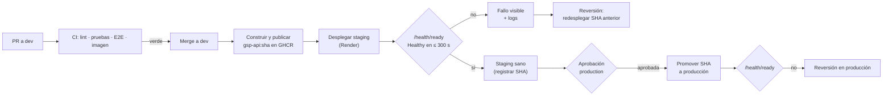

# Estrategia de despliegue (pipelines CI/CD)

> **Informe de planeación** (2026-09-11). Resume la estrategia de la
> [spec 003](../../specs/003-infraestructura-como-codigo/spec.md) y retoma los issues #131 (primera
> mitad hecha: `docker-image.yml`) y #189 (disparador, verificación y reversión).

## 1. Estado actual

| Aspecto | Hoy |
|---|---|
| Hosting | Render (API en contenedor, puerto 10000) detrás de Cloudflare; frontend sin destino documentado en el repo |
| Disparo | **Manual** desde el panel de Render; no hay `render.yaml` |
| Verificación | `docker-image.yml` construye la imagen y la arranca en CI contra PostgreSQL 18, pero no despliega |
| Trazabilidad | La versión desplegada no se liga a un commit |
| Migraciones | `entrypoint.sh` con `set -e`: si `efbundle` falla, el contenedor muere sin responder |
| Reversión | No existe un procedimiento |
| Infraestructura | Configurada a mano en paneles; sin IaC |

## 2. Principios

1. **Imagen inmutable por commit:** `ghcr.io/<owner>/gsp-api:<sha>`; se despliega la misma imagen que se probó.
2. **Solo se despliega lo que pasó CI:** `dev` protegida con checks obligatorios.
3. **Un despliegue no está terminado hasta que `/health/ready` responde `Healthy`.**
4. **Reversión = redesplegar el SHA anterior.** Las migraciones destructivas no se revierten con la imagen.
5. **Infraestructura como código revisada en PR:** `terraform plan` en el PR y `apply` con aprobación.
6. **Producción con aprobación manual** en un GitHub Environment.

## 3. Ambientes

| Ambiente | Plataforma | Se actualiza | Aprobación |
|---|---|---|---|
| Desarrollo | GitHub Codespaces (devcontainer) | Al crear o reconstruir el codespace | No |
| Staging | Render, definido con Terraform | Automático en cada merge a `dev` | Solo para cambios de infraestructura |
| Producción | Render (actual) | Promoción manual de un SHA sano | Sí (environment `production`) |

## 4. Pipeline



| Etapa | Herramienta | Disparador | Puerta | Meta |
|---|---|---|---|---|
| Integración continua | GitHub Actions (5 workflows actuales) | PR | Todos en verde | < 15 min |
| Imagen | `docker/build-push-action` → GHCR | Merge a `dev` | Build correcto | Etiqueta = SHA |
| Despliegue a staging | `deploy-staging.yml` | Imagen publicada | Concurrencia sin cancelar | — |
| Verificación | Sondeo de `health_url` cada 10 s | Tras desplegar | `"status":"Healthy"` en ≤ 300 s | Commit → staging ≤ 20 min |
| Promoción | `promote-production.yml` | Manual con `sha` | Revisor del environment | — |
| Reversión | `deploy-staging.yml` con entrada `sha` | Manual | — | ≤ 10 min |

## 5. Migraciones

- `efbundle` sigue aplicando las migraciones al arrancar, pero **deja de ser fatal**: un fallo se
  registra y la aplicación arranca igual.
- Una sonda nueva, `MigrationsHealthCheck`, hace que `/health/ready` responda 503 mientras haya
  migraciones pendientes. Así el despliegue falla de forma visible y `/health/live` sigue respondiendo.
- Con más de una réplica todas intentarían migrar; staging tiene una sola. Antes de escalar producción
  se evaluará un paso de migración previo e independiente.

## 6. Infraestructura como código

```text
infra/
├── modules/render-stack/     API (imagen GHCR) · frontend (Node) · PostgreSQL (prevent_destroy) · grupo de variables
├── modules/github-platform/  environments staging/production/infra · secretos de Actions y Codespaces
└── envs/staging/             composición de ambos módulos · estado remoto en HCP Terraform
```

- `infra-plan.yml` publica el plan como comentario del PR.
- `infra-apply.yml` aplica con aprobación en el environment `infra`.
- Los secretos se proveen desde GitHub Secrets o Environments; ningún valor vive en el repo.
- **Multi-proveedor:** Render (ejecución) + GitHub (plataforma y Codespaces), detrás de una interfaz común
  de módulos, de modo que agregar otra nube solo requiere un módulo nuevo.

## 7. Reversión

1. Identificar el último SHA sano (historial de `deploy-staging`).
2. **Actions → deploy-staging → Run workflow → `sha`**.
3. Esperar `Healthy` y registrar el incidente.
4. Si hubo una migración destructiva, restaurar datos con los scripts de respaldo, siempre a petición
   explícita y con confirmación (constitución, Principio IV).

## 8. Métricas (DORA)

| Métrica | Hoy | Meta del piloto |
|---|---|---|
| Frecuencia de despliegue a staging | Manual, esporádica | Cada merge a `dev` |
| Tiempo commit → staging | Desconocido | ≤ 20 min |
| Tasa de despliegues fallidos | No se mide | Visible en el historial de Actions |
| Tiempo de recuperación | Sin procedimiento | ≤ 10 min por reversión |

## 9. Plan de implementación

| Orden | Entregable | Tareas de la spec 003 |
|---|---|---|
| 1 | Codespaces (MVP, sin riesgo para producción) | T008–T011 |
| 2 | Estado remoto, escaneo de secretos, protección de `dev` | T005–T007 |
| 3 | Staging con Terraform + plan/apply en PR | T012–T018 |
| 4 | Migración no fatal + sonda + pruebas | T019–T023 |
| 5 | Despliegue verificado y reversión | T024–T027 |
| 6 | Plataforma GitHub declarativa | T028–T030 |
| 7 | README y validación | T031–T034 |

**Decisiones abiertas:** mecanismo de actualización de la imagen en Render (T024) y la
interpretación de Codespaces como segundo proveedor, pendiente de confirmar por el responsable.

> **[DIAGRAMA: pipeline de despliegue — exportar el Mermaid de la sección 4]**
