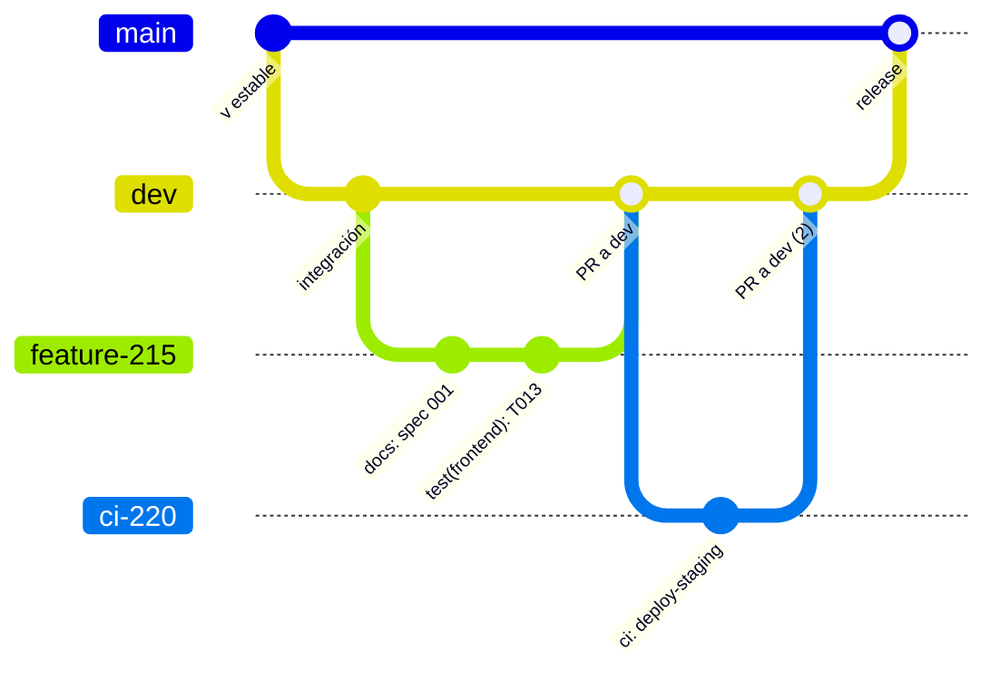
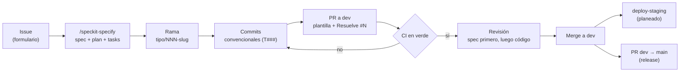

# Flujo de trabajo para el control de versiones y CI/CD

> **Informe de planeación** (2026-09-11). Describe el flujo vigente (git + GitHub Actions), cómo se
> integra con SDD y qué protecciones faltan. Base: `.github/` y las reglas del proyecto.

## 1. Modelo de ramas

`main` (estable) ← `dev` (integración) ← ramas de trabajo con prefijo y número de issue.

*(En el diagrama, `feature-215` representa `feat/215-…` y `ci-220` representa `ci/220-…`; Mermaid no
admite `/` en los nombres de rama de `gitGraph` sin comillas.)*

| Prefijo | Uso | ¿Dispara workflows en push? |
|---|---|---|
| `feat/` | Funcionalidad | Sí (lint, pruebas, frontend, imagen) |
| `fix/` | Corrección | Sí |
| `chore/` | Mantenimiento | Sí |
| `ci/` | Pipelines | Sí (frontend, imagen) |
| `test/` | Pruebas | No en push; sí en el PR si toca `backend/**` o `frontend/**` |
| `docs/` | Documentación | No en push; sí en el PR solo si toca rutas filtradas |
| `perf/`, `refactor/` | Rendimiento, refactor | Según rutas en el PR |

## 2. Convenciones

- **Commits convencionales con ámbito:** `feat(backend): …`, `fix(frontend): …`, `test(frontend): …`,
  `ci: …`, `docs(sdd): …`. Con SDD se cita la tarea: `test(frontend): E2E del catálogo (T013)`.
- **Issues:** 8 formularios en `.github/ISSUE_TEMPLATE/` (FEATURE, CHORE, BUG, CI, DOCS, PERF,
  REFACTOR, TEST), cada uno con Definición de Listo obligatoria. Los borradores viven en
  `.github/DRAFTS/` (local).
- **PR:** plantilla `.github/PULL_REQUEST_TEMPLATE/01-pull_request_template.md` (resumen, tipo,
  archivos, cómo probarlo, checklist) con `Resuelve #N` y, desde SDD, el enlace a `specs/NNN-…`.
- **Nunca** commits directos a `main` ni a `dev`; nunca `.env`, `*.sql`, `backups/`, `coverage/`.

## 3. Flujo de un cambio

1. Se abre el issue con su formulario; si es una feature, se crea el spec con las skills.
2. Rama desde `dev`: `feat/<issue>-<slug>`.
3. Commits pequeños y convencionales; `dotnet tool run csharpier format backend/` antes de entregar.
4. PR a `dev` con la plantilla. El CI corre según las rutas tocadas.
5. Revisión: primero el diff del spec y del plan, después el código; checklists de dominio marcados.
6. Merge a `dev`. Cuando `dev` está estable, PR `dev → main`.

## 4. Pipelines de CI vigentes (GitHub Actions)

| Workflow | Push | PR a `main`/`dev` (rutas) | Qué bloquea |
|---|---|---|---|
| `backend-lint.yml` | `main`, `dev`, `feat/**`, `chore/**`, `fix/**` | `backend/**`, `.editorconfig`, `.csharpierrc.json` | Formato CSharpier y errores de compilación con analizadores |
| `backend-tests.yml` | Ídem | `backend/**` | Pruebas unitarias e integración; publica cobertura |
| `frontend-tests.yml` | Ídem + `ci/**` | `frontend/**` | Build de Next.js y E2E de Playwright |
| `docker-image.yml` | Ídem + `ci/**` | `Dockerfile`, `entrypoint.sh`, `backend/**` | Imagen que no arranca o no responde `Healthy` |
| `codeql.yml` | Según configuración | Según configuración | Hallazgos de seguridad |
| Dependabot | Programado | — | Abre PR de actualización de dependencias |

## 5. Protecciones planeadas

| Protección | Configuración | Origen |
|---|---|---|
| `dev` protegida | Checks obligatorios: `backend-lint`, `backend-tests`, `frontend-tests`, `docker-image`; 1 revisión | Spec 003, T007 |
| `main` protegida | Solo PR desde `dev`, checks obligatorios y 1 revisión | Propuesto |
| Escaneo de secretos | `secret-scan.yml` (gitleaks) en cada PR | Spec 003, T006 |
| Check de SDD | El cuerpo de un PR `feat/` debe enlazar `specs/` | Guía SDD, fase 4 |
| Environments | `staging`, `production` e `infra` con revisores | Spec 003, T028 |

## 6. ¿Por qué GitHub Actions y no Jenkins o Travis?

| Criterio | GitHub Actions (elegido) | Jenkins | Travis CI |
|---|---|---|---|
| Infraestructura | Gestionada por GitHub | Servidor propio que hay que mantener | Gestionada |
| Integración con PR, issues, environments y secretos | Nativa | Por plugins | Parcial |
| Costo para un repo académico | Minutos incluidos | Hosting propio | Planes de pago |
| Estado en el proyecto | 5 workflows en uso | — | — |

## 7. Repositorio preparado para recibir el código fuente

| Elemento | Estado |
|---|---|
| Ramas `main` y `dev`, convención de prefijos | Listo |
| Plantillas de issues (8) y de PR | Listo |
| CI de backend, frontend, imagen y seguridad | Listo |
| `.gitignore` (secretos, respaldos, cobertura, reportes, `.claude/*` salvo skills) | Listo |
| Spec Kit (`.specify/`, skills, constitución, `specs/`) | Listo con el PR de adopción de SDD |
| Protección de ramas y environments | Planeado (spec 003) |
| Entorno reproducible (`.devcontainer/`) | Planeado (spec 003) |

> **[CAPTURA: pestaña Actions con los workflows]** · **[CAPTURA: Settings → Branches]**
