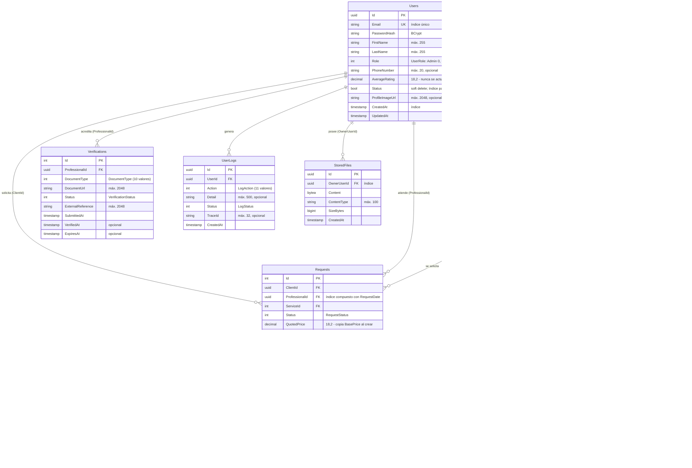
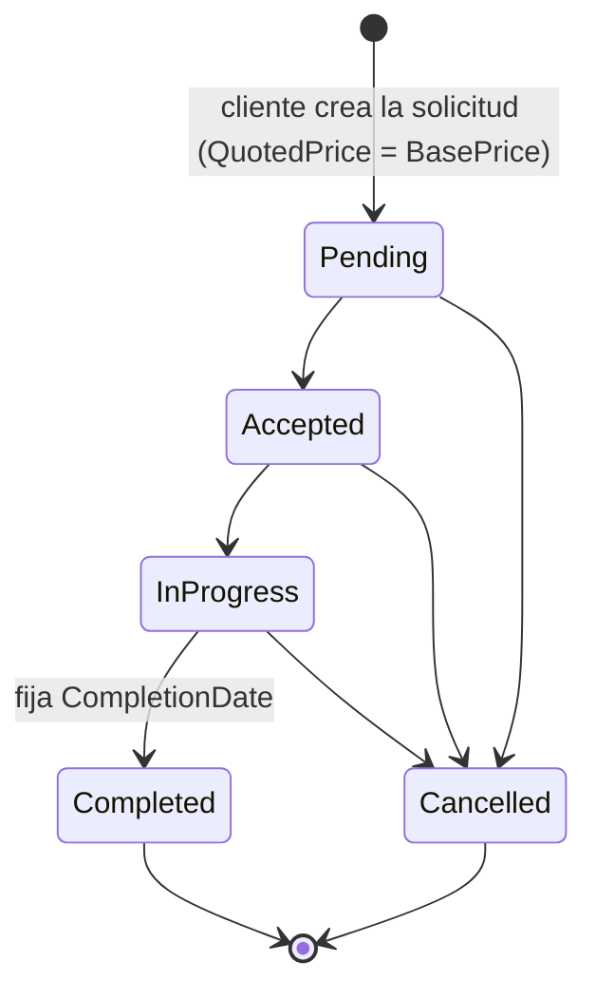

# Modelo de datos actual (ingeniería inversa)

> Fuente: `backend/SistemaServicios.API/Models/*.cs`, `Data/AppDbContext.cs` y
> `Migrations/AppDbContextModelSnapshot.cs` en `dev` @ 0159a9b (2026-09-11).
> Nombres de tabla = nombres de los `DbSet` (convención de EF Core). Motor: PostgreSQL.

## 1. Diagrama entidad-relación

## 2. Comportamiento al borrar

| Relación (hijo → padre) | FK | `OnDelete` | Origen |
|---|---|---|---|
| Services → Users | `ProfessionalId` | **Cascade** | Convención de EF (FK requerida) |
| Services → Categories | `CategoryId` | **Cascade** | Convención |
| Requests → Users (cliente) | `ClientId` | Restrict | Explícito en `AppDbContext` |
| Requests → Users (profesional) | `ProfessionalId` | Restrict | Explícito |
| Requests → Services | `ServiceId` | **Cascade** | Convención |
| Ratings → Requests | `RequestId` | **Cascade** | Convención |
| Ratings → Users (cliente / profesional) | `ClientId`, `ProfessionalId` | Restrict | Explícito |
| Quotes → Users | `ClientId` | **Cascade** | Convención |
| Quotes → Services | `ServiceId` | **Cascade** | Convención |
| Verifications → Users | `ProfessionalId` | **Cascade** | Convención |
| UserLogs → Users | `UserId` | Restrict | Explícito |
| StoredFiles → Users | `OwnerUserId` | Restrict | Explícito |

## 3. Enumeraciones

| Enum | Valores |
|---|---|
| `UserRole` | Admin = 0, Client = 1, Professional = 2 |
| `RequestStatus` | Pending = 0, Accepted = 1, InProgress = 2, Completed = 3, Cancelled = 4 |
| `QuoteStatus` | Pending = 0, Accepted = 1, Rejected = 2, Expired = 3 |
| `VerificationStatus` | Pending = 0, Verified = 1, Rejected = 2 |
| `DocumentType` | TituloProfesional = 1 … LicenciaTecnica = 10 |
| `LogAction` | CambioContrasena = 0 … EliminacionServicio = 10 |
| `LogStatus` | Exitoso = 0, Alerta = 1, Error = 2 |

## 4. Índices

| Tabla | Índice | Migración |
|---|---|---|
| Users | `Email` único | `AddUserIndexes` (2026-08-09) |
| Users | `CreatedAt` | `AddUserIndexes` |
| Users | `Status` parcial (`"Status" = true`) | `AddUserIndexes` |
| Requests | `(ProfessionalId, RequestDate)` | `AddRequestCompositeIndex` (2026-08-09) |
| StoredFiles | `OwnerUserId` | `AddStoredFiles` (2026-08-13) |
| (todas las FK) | Índice por FK | Convención de EF |

## 5. Ciclo de vida implementado de una solicitud

Extraído de `ServiceRequestService.IsValidTransition`. Solo el profesional asignado o un Admin
cambian el estado; `CompletionDate` se fija al completar.

`QuoteStatus` y `VerificationStatus` están declarados pero **ningún código los usa**: no existe
lógica de transición para cotizaciones ni verificaciones.

## 6. Historia del esquema

| Fecha | Migración | Cambio |
|---|---|---|
| 2026-02-18 | `InitialCreate` | Users, Categories, Services, Requests, Quotes, Ratings, Verifications |
| 2026-03-11 | `AddUserLogs` | Bitácora de acciones |
| 2026-03-14 | `SeedCategories` | Datos iniciales de categorías |
| 2026-08-09 | `AddUserIndexes` | Índices de Users |
| 2026-08-09 | `AddRequestCompositeIndex` | Índice compuesto de Requests |
| 2026-08-13 | `AddStoredFiles` | Avatares en base de datos |
| 2026-08-14 | `AddTraceIdToUserLog` | Enlace bitácora ↔ log de operación |

## 7. Observaciones del modelo

| # | Observación | Riesgo | Referencia |
|---|---|---|---|
| M1 | **Cadena de borrado en cascada** Categories → Services → Requests → Ratings. Borrar una categoría eliminaría servicios, solicitudes y calificaciones. Hoy ninguna API borra categorías, así que el riesgo está latente | Alto (pérdida de datos) | §2 |
| M2 | `Quotes` no se relaciona con `Requests`: una cotización nunca alimenta una solicitud; `QuotedPrice` copia el precio base | Funcional | `ServiceRequestService.CreateRequestAsync` |
| M3 | `Ratings.ProfessionalId` es redundante con `Requests.ProfessionalId` y se toma del DTO del cliente | Integridad | `RatingService.CreateRatingAsync` |
| M4 | No hay índice único `(RequestId, ClientId)` en Ratings: la unicidad solo se valida en la aplicación (condición de carrera posible) | Integridad | `IRatingRepository.ExistsRatingForRequestAsync` |
| M5 | `Users.AverageRating` está desnormalizado y nunca se actualiza (el promedio se calcula al vuelo en otro endpoint) | Dato engañoso | `RatingService.GetProfessionalAverageRatingAsync` |
| M6 | Borrado inconsistente: Users → Services, Quotes y Verifications en Cascade; Users → Requests y Ratings en Restrict. El soft delete lo mitiga mientras nadie borre físicamente | Medio | §2 |
| M7 | `Verifications.DocumentUrl` es texto libre aunque ya existe `StoredFiles` para binarios | Diseño | `Verification.cs` |
| M8 | Nada garantiza a nivel de datos que `Services.ProfessionalId` apunte a un usuario con rol Professional | Integridad | `Service.cs` |
| M9 | Identificadores mixtos: `uuid` en Users, UserLogs y StoredFiles; `int` en el resto | Bajo | — |
