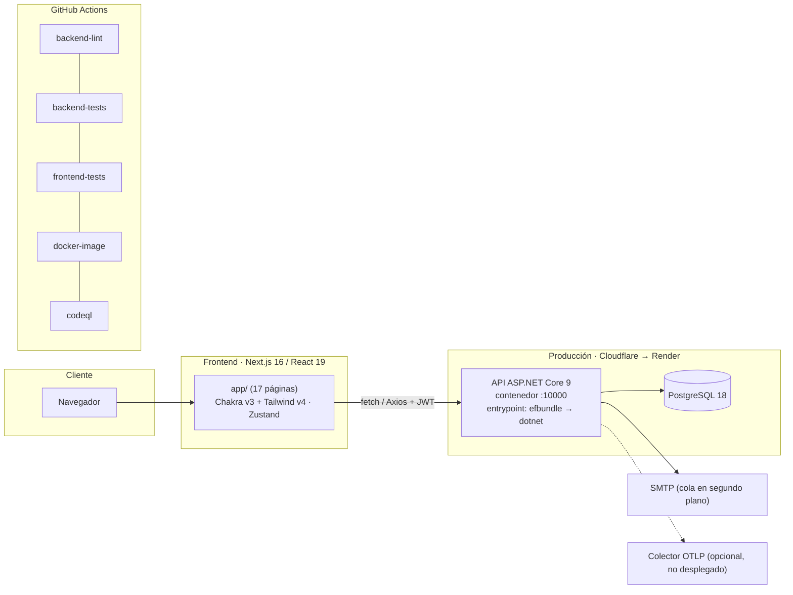

# Ingeniería inversa: estado actual del sistema

> **Línea base:** rama `dev` @ 0159a9b (2026-09-11).
>
> **Método:** lectura del código (`Controllers/`, `Services/`, `Repositories/`, `Models/`,
> `AppDbContext`), del snapshot de migraciones, de `frontend/app` y `frontend/src`, de los workflows
> y del historial de git.
>
> **Relacionados:** [modelo de datos](er-diagram.md) · [trazabilidad](trazabilidad.md) · [brechas](analisis-brechas.md)

## 1. Resumen en cifras

| Métrica | Valor |
|---|---|
| Commits en `dev` / merges de PR | 277 / 104 |
| Controllers / endpoints HTTP (incluidas las 2 sondas) | 10 / 40 |
| Entidades / migraciones | 9 / 7 |
| Páginas del frontend | 17 |
| Archivos de prueba: unitarios / integración / E2E | 20 / 9 (+ factory) / 11 |
| Workflows de CI | 5 (+ Dependabot) |
| Casos de prueba formales documentados | 4 (`backend/docs/test-plan.md`) |
| Especificaciones de requisitos versionadas (antes de SDD) | 0 |

## 2. Arquitectura

- **Backend:** `Controller → Service (Interfaces/) → Repository → AppDbContext`. Ningún controller
  usa `AppDbContext` directamente (verificado con búsqueda). Composición en
  `Extensions/ApplicationServiceExtensions.cs`.
- **Transversales:** rate limiting (`AuthLimiter`) en login, registro y recuperación; Serilog en
  JSON a stdout con redacción de secretos; OpenTelemetry (ASP.NET Core, HttpClient, Npgsql);
  cabeceras reenviadas (`FORWARDED_LIMIT`); sondas `/health/live` y `/health/ready`; correo y
  respaldo en segundo plano (`BackgroundTaskDispatcher`, `QueuedHostedService`).
- **Despliegue:** Render construye la imagen por su cuenta y el despliegue se dispara **a mano**;
  no hay `render.yaml`. El destino del frontend no está documentado en el repo.

## 3. Inventario de la API

**Leyenda de acceso:** Público (sin atributo y sin política global de respaldo) · Autenticado (`[Authorize]`) · Rol(es).

| Módulo | Método y ruta | Acceso | Servicio |
|---|---|---|---|
| Auth | `POST /api/Auth/login` | Público + rate limit | `AuthService`, `TokenService` |
| Auth | `POST /api/Auth/register` | Público + rate limit | `AuthService` |
| Auth | `GET /api/Auth/me` | Autenticado | — (claims) |
| Auth | `POST /api/Auth/forgot-password` | Público + rate limit | `AuthService`, `EmailService` |
| Users | `GET /api/Users` | Admin | `UserService` |
| Users | `GET /api/Users/{id}` | Autenticado | `UserService` |
| Users | `POST /api/Users` | Admin | `UserService` |
| Users | `PUT /api/Users/{id}` | Admin | `UserService` |
| Users | `DELETE /api/Users/{id}` | Admin (soft delete) | `UserService` |
| Users | `GET /api/Users/stats/registrations` | Autenticado | `UserService` |
| UserLogs | `GET /api/UserLogs` | Autenticado | `UserLogService` |
| UserLogs | `POST /api/UserLogs` | Autenticado (`UserId` viene del cuerpo) | `UserLogService` |
| Profile | `GET /api/Profile` | Autenticado | `UserService` |
| Profile | `PUT /api/Profile` | Autenticado | `UserService` |
| Profile | `PUT /api/Profile/password` | Autenticado | `UserService` |
| Profile | `POST /api/Profile/foto` | Autenticado (magic bytes) | `UserService`, `IFileStorage` |
| Files | `GET /api/Files/{id}` | Público | `IFileStorage` (`DbFileStorage` / `LocalFileStorage`) |
| Categories | `GET /api/Categories` | Público | `CategoryService` |
| Categories | `GET /api/Categories/{id}` | Público | `CategoryService` |
| Services | `GET /api/Services` | Público (paginado: `{ data, totalCount, page, size }`) | `ServiceService` |
| Services | `GET /api/Services/{id}` | Público | `ServiceService` |
| Services | `GET /api/Services/my` | Professional | `ServiceService` |
| Services | `POST /api/Services` | Professional | `ServiceService` |
| Services | `PUT /api/Services/{id}` | Professional (dueño), Admin | `ServiceService` |
| Services | `PATCH /api/Services/{id}/toggle` | Professional (dueño), Admin | `ServiceService` |
| Services | `DELETE /api/Services/{id}` | Professional (dueño), Admin | `ServiceService` |
| ServiceRequests | `POST /api/ServiceRequests` | Client, Professional | `ServiceRequestService` |
| ServiceRequests | `GET /api/ServiceRequests/{id}` | Autenticado (dueño o Admin) | `ServiceRequestService` |
| ServiceRequests | `GET /api/ServiceRequests/my` | Client, Professional | `ServiceRequestService` |
| ServiceRequests | `GET /api/ServiceRequests/professional` | Professional | `ServiceRequestService` |
| ServiceRequests | `PUT /api/ServiceRequests/{id}/status` | Professional (asignado), Admin | `ServiceRequestService` |
| Ratings | `POST /api/Ratings` | Client, Professional, Admin | `RatingService` |
| Ratings | `GET /api/Ratings/professional/{id}` | Público | `RatingService` |
| Ratings | `GET /api/Ratings/professional/{id}/average` | Público | `RatingService` |
| Admin | `POST /api/Admin/backup` | Admin | `BackupService`, `BackupJobTracker` |
| Admin | `GET /api/Admin/backup/jobs/{id}` | Admin | `BackupJobTracker` |
| Admin | `GET /api/Admin/backups` | Admin | `BackupService` |
| Admin | `GET /api/Admin/backups/{fileName}` | Admin | `BackupService` |
| Salud | `GET /health/live` | Público | — |
| Salud | `GET /health/ready` | Público | `DatabaseHealthCheck` |

**Entidades sin API:** `Quote` (cotización) y `Verification` (verificación de profesionales).

## 4. Frontend

| Ruta | Acceso a datos | Sigue el patrón `src/services` / feature | E2E |
|---|---|:--:|:--:|
| `/` , `/landing` | Contenido estático | — | — |
| `/about` | Estático | — | `about.spec` |
| `/login` | `fetch` directo a `/api/auth/login` | No | `login.spec` |
| `/register` | `fetch` directo; respaldo fijo `http://localhost:5000` | No | `register.spec` |
| `/recovery` | **Sin llamada a la API** (solo interfaz) | — | `recovery.spec` |
| `/dashboard` (catálogo) | `fetch` directo a `/api/services` | No | — |
| `/catalogo/[id]` | `fetch` a `/api/services/{id}` y `POST /api/servicerequests` | No | — |
| `/profesionista` | `fetch` a `/api/categories` y `/api/services` | No | — |
| `/solicitudes` | `fetch` a `/servicerequests/my`, `/professional` y `PUT …/status` | No (existe `src/features/solicitudes/` con repositorio mock) | — |
| `/perfil`, `/perfil/contrasena` | `src/services/profile.service.ts` (Axios) | Sí | `perfil.spec`, `contrasena.spec` |
| `/usuarios` | `fetch` directo a `/api/Users` (CRUD) | No | `usuarios.spec` |
| `/usuarios/registrados` | Tarjetas con datos mock | — | `registered.spec` |
| `/usuarios/logs` | `fetch` a `/api/Users` y `/api/UserLogs` | No | `logs.spec` |
| `/usuarios/grafica` | `fetch` a `/api/Users/stats/registrations` | No | `grafica.spec` |
| `/usuarios/respaldos` | `src/features/respaldos/` + `backup.service.ts` | Sí | `respaldos.spec` |

**Observaciones:**

- Sesión: token en `localStorage` (`token`) y usuario en Zustand persistido (`auth-user`). El rol se
  guarda como nombre (`"Client"`) si viene del login, o como número en texto (`"1"`) si viene del
  perfil.
- La navegación (`nav.tsx`) muestra los mismos enlaces a todos los roles.
- `MSWProvider` está comentado en `app/layout.tsx`; los E2E simulan la API con `page.route`.
- Las pantallas de catálogo, detalle, profesionista y solicitudes no tienen `data-testid`.
- `next.config.ts` copia **todo** el `.env` de la raíz a `env` de Next.

## 5. Pruebas

| Nivel | Archivos | Cubren |
|---|---|---|
| Unitarias (`Unit/`) | 20 | Auth (servicio, controller, recuperación), Token, Email y su cola, Users (servicio, repositorio, estadísticas), UserLogs (servicio, repositorio), Perfil (servicio, controller), DbFileStorage, Backup (servicio, tracker, controller), telemetría, redacción de secretos, rutas de sondeo |
| Integración (`Integration/`) | 9 + `CustomWebApplicationFactory` | Auth, Admin, Perfil, Files, Health, Forwarded headers, CORS, Swagger, Logging |
| E2E (`frontend/tests/`) | 11 | about, login, register, recovery, perfil, contraseña, usuarios, registrados, gráfica, logs, respaldos |
| **Sin pruebas** | — | Services, Categories, ServiceRequests y Ratings (ningún nivel); integración de Users; E2E de catálogo, detalle, profesionista y solicitudes |

## 6. CI/CD e infraestructura

| Elemento | Qué hace |
|---|---|
| `backend-lint.yml` | CSharpier `check` + build con analizadores; resumen de avisos SA/RCS |
| `backend-tests.yml` | `dotnet test` con cobertura (ReportGenerator) y artefactos `.trx` |
| `frontend-tests.yml` | `npm ci`, `npm run build`, Playwright solo en Chromium, reporte como artefacto |
| `docker-image.yml` | Construye la imagen y la arranca contra `postgres:18-alpine`; espera `/health/ready` `Healthy` |
| `codeql.yml` + `dependabot.yml` | Análisis de seguridad y actualización de dependencias |
| `Dockerfile` | 3 etapas: build, bundle de migraciones (`efbundle`) y runtime `aspnet:9.0` con `postgresql-client-18`; `HEALTHCHECK` a `/health/ready` |
| `entrypoint.sh` | `set -e`; aplica `efbundle` y luego `exec dotnet`: si falla la migración, el contenedor muere |
| `docker-compose.yml` + `nginx/` | API detrás de NGINX para verificar las cabeceras reenviadas |
| **Ausentes** | `.devcontainer/`, IaC (`*.tf`), `render.yaml`, workflow de despliegue |

## 7. Configuración (`.env.example`)

`DB_HOST`, `DB_PORT`, `DB_NAME`, `DB_USER`, `DB_PASSWORD`, `JWT_KEY`, `JWT_ISSUER`, `JWT_AUDIENCE`,
`JWT_EXPIRES_MINUTES`, `ALLOWED_ORIGINS`, `NEXT_PUBLIC_ALLOWED_PATH`, `FORWARDED_LIMIT`,
`FORWARDED_NETWORKS`, `FILE_STORAGE`, `BACKUP_DIR`, `OTEL_EXPORTER_OTLP_ENDPOINT`, `SMTP_HOST`,
`SMTP_PORT`, `SMTP_USER`, `SMTP_PASSWORD`, `SMTP_FROM`.

## 8. Reglas de negocio extraídas del código

| # | Regla implementada | Dónde |
|---|---|---|
| RN1 | El registro público siempre crea rol Client (anti mass-assignment) | `AuthService` (commits e7887cc, 28be364) |
| RN2 | Los mensajes de login no revelan si el correo existe | commit e0f3fe2 |
| RN3 | Máximo 5 intentos por minuto en login, registro y recuperación | `AuthLimiter` en `Program.cs` |
| RN4 | Borrado de usuarios lógico (`Status = false`); los listados solo muestran activos | `UserRepository` |
| RN5 | Una solicitud copia el precio base del servicio como `QuotedPrice` y nace Pendiente | `ServiceRequestService.CreateRequestAsync` |
| RN6 | Solo se puede solicitar un servicio activo | Idem |
| RN7 | Transiciones válidas: Pending → Accepted/Cancelled; Accepted → InProgress/Cancelled; InProgress → Completed/Cancelled | `ServiceRequestService.IsValidTransition` |
| RN8 | Solo el profesional asignado o un Admin cambian el estado de una solicitud | Idem |
| RN9 | Solo el dueño o un Admin editan, activan o borran un servicio | `ServiceService` |
| RN10 | Un cliente no puede calificar dos veces la misma solicitud (solo en la aplicación) | `RatingService` |
| RN11 | El promedio de calificaciones se calcula al vuelo con un decimal | `RatingService.GetProfessionalAverageRatingAsync` |
| RN12 | Las imágenes de perfil se validan por magic bytes | commit b4c88b3 |

## 9. Historia del proyecto

| Periodo | Hitos |
|---|---|
| 2026-02 | Esquema inicial (`InitialCreate`) con las 7 entidades de negocio |
| 2026-03 | CI de lint y pruebas; auth, recuperación, perfil, CRUD de usuarios, bitácora y gráfica; servicios, categorías y solicitudes |
| 2026-08 (1.ª quincena) | Endurecimiento de seguridad (escalamiento de rol, IDOR, enumeración, rate limiting, errores sanitizados, magic bytes); índices; proyección a DTO |
| 2026-08 (2.ª quincena) | Operación: sondas de salud, proxy inverso, avatares en BD, respaldo en segundo plano, Serilog + OpenTelemetry, E2E en CI, imagen Docker verificada en CI |
| 2026-09 | Plan de pruebas formal (PR #209); adopción de SDD (esta línea base) |
