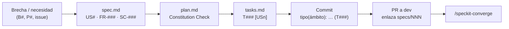

# Matriz de trazabilidad: línea base y pilotos

> Reconstruida por ingeniería inversa sobre `dev` @ 0159a9b (2026-09-11). Antes de SDD no existía
> un identificador de requisito; el "requisito" de cada módulo se toma de la descripción del
> producto en el README y de los issues citados en ramas y commits.

## 1. Trazabilidad hacia atrás (estado actual)

| Módulo (requisito de producto) | Endpoints | Lógica | UI | Unit | Integr. | E2E | Evidencia en git | Cadena |
|---|---|---|---|:--:|:--:|:--:|---|---|
| Autenticación y registro | `/api/Auth/*` (4) | `AuthService`, `TokenService` | `/login`, `/register` | Sí | Sí | Sí | #1, #138, #139; commits e7887cc, e0f3fe2, a04578e | **Completa** |
| Recuperación de contraseña | `POST /api/Auth/forgot-password` | `AuthService`, `EmailService`, `QueuedEmailService` | `/recovery` (sin conectar) | Sí | Parcial | Sí (solo UI) | commit 4943cec; rama `feat/sec-issue-136-reset-tokenn` | **Rota en la UI** |
| Administración de usuarios | `/api/Users/*` (6) | `UserService`, `UserRepository` | `/usuarios`, `/usuarios/registrados`, `/usuarios/grafica` | Sí | **No** | Sí | #11, #12, #119, #135, #144, #149 | Parcial |
| Bitácora de acciones | `/api/UserLogs` (2) | `UserLogService`, `UserLogRepository` | `/usuarios/logs` | Sí | **No** | Sí | #124 (TraceId); commit dc9ba8e | Parcial |
| Perfil y avatar | `/api/Profile/*` (4), `/api/Files/{id}` | `UserService`, `IFileStorage` | `/perfil`, `/perfil/contrasena` | Sí | Sí | Sí | #125, #141 | **Completa** |
| Catálogo de servicios (publicación y consulta) | `/api/Services/*` (7), `/api/Categories/*` (2) | `ServiceService`, `CategoryService` | `/dashboard`, `/catalogo/[id]`, `/profesionista` | **No** | **No** | **No** | #19, #20, #129; commit 5a38ef7 | **Sin pruebas** |
| Solicitud y seguimiento | `/api/ServiceRequests/*` (5) | `ServiceRequestService` | `/solicitudes`, `/catalogo/[id]` | **No** | **No** | **No** | #22, #145; commits 0dd0e8b, c0d76b0 | **Sin pruebas** |
| Evaluación (calificaciones) | `/api/Ratings/*` (3) | `RatingService` | **Ninguna** | **No** | **No** | **No** | #16; commit 7b70347 | **Sin UI ni pruebas** |
| Cotización | **Ninguno** | **Ninguna** (solo `Quote`) | **Ninguna** | — | — | — | #110 (ramas remotas sin integrar) | **No implementado** |
| Verificación de profesionales | **Ninguno** | **Ninguna** (solo `Verification`) | **Ninguna** | — | — | — | — | **No implementado** |
| Respaldos (administración) | `/api/Admin/*` (4) | `BackupService`, `BackupJobTracker`, `ProcessRunner` | `/usuarios/respaldos` | Sí | Sí | Sí | #126, #133, #158; commit e370cb9 | **Completa** |
| Operación (salud, proxy, logs) | `/health/*` | `DatabaseHealthCheck`, middleware | — | Sí | Sí | — | #123, #124, #128, #131 | Completa |

**Resumen:** de los 12 módulos, 4 tienen la cadena completa, 3 parcial, 2 funcionan sin ninguna
prueba, 1 no tiene UI ni pruebas, 1 tiene la UI desconectada y 2 de los que anuncia el producto
(cotización y verificación) no existen.

## 2. Trazabilidad hacia adelante (SDD)

Desde esta instalación, cada cambio se traza así:

| Origen | Spec | Historias | Requisitos | Tareas |
|---|---|---|---|---|
| B9 (módulos sin E2E) | [001 — Pruebas E2E con IA](../../../specs/001-e2e-playwright-mcp/spec.md) | US1 catálogo → solicitud · US2 servicios del profesional · US3 seguimiento · US4 IA | FR-001 … FR-012 | [tasks.md](../../../specs/001-e2e-playwright-mcp/tasks.md) |
| B14 (sin onboarding) | [002 — Guía interactiva](../../../specs/002-guia-interactiva-tours/spec.md) | US1 cliente · US2 profesional · US3 admin · US4 volver a ver | FR-001 … FR-014 | [tasks.md](../../../specs/002-guia-interactiva-tours/tasks.md) |
| B12, B13 (despliegue manual, sin IaC ni entorno) | [003 — Software como infraestructura](../../../specs/003-infraestructura-como-codigo/spec.md) | US1 Codespaces · US2 staging declarativo · US3 despliegue verificado · US4 multi-proveedor | FR-001 … FR-017 | [tasks.md](../../../specs/003-infraestructura-como-codigo/tasks.md) |
| B1 | 004 — Cotización (propuesto) | — | — | — |
| B2 | 005 — Verificación de profesionales (propuesto) | — | — | — |
| B3 | 006 — Reglas de calificación (propuesto) | — | — | — |
| Necesidad nueva (issue #228, sin brecha de origen) | [007 — Créditos de autores](../../../specs/007-creditos-autores/spec.md) | US1 consulta pública · US2 administración · US3 fotografía | FR-001 … FR-022 | [tasks.md](../../../specs/007-creditos-autores/tasks.md) |

> **Sobre la columna de origen.** Las specs 001 a 006 provienen de brechas detectadas por
> ingeniería inversa y se identifican con `B#`. La 007 proviene de una necesidad nueva del
> producto y se identifica con su issue. Los requisitos que no nacen de una brecha usan esta
> segunda forma.

La cobertura requisito → tarea de cada piloto está en la sección *Coverage Summary* del reporte de
`/speckit-analyze` de su carpeta (`analysis.md`).
