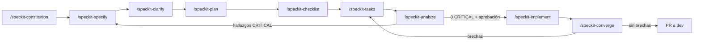

# Guía de implementación de SDD — Gestión de Servicios Profesionales

> **Vigente desde:** 2026-09-11 · **Herramienta:** GitHub Spec Kit v1.0.6 · **Agente:** Claude Code (skills)
>
> **Relacionados:** [Propuesta](sdd-proposal.md) · [Guía de instalación](guia-instalacion-spec-kit.md) ·
> [Estado actual](estado-actual/ingenieria-inversa.md) · [Constitución](../../.specify/memory/constitution.md)

---

## 1. Qué es Spec-Driven Development

**Spec-Driven Development (SDD)** es una forma de construir software en la que la
**especificación es el artefacto principal** y el código es un derivado que se verifica contra
ella. En el enfoque habitual (*code-first*) la intención vive en conversaciones, issues y en la
cabeza de quien programó; el único artefacto duradero es el código. En SDD la intención queda
escrita, versionada y revisada **antes** de escribir código, y la consistencia entre intención,
diseño, tareas y código se comprueba de forma sistemática.

Principios que adopta este proyecto:

1. **La especificación es la fuente de verdad del comportamiento.** Si el código y el spec
   discrepan, uno de los dos está mal y se decide cuál, explícitamente.
2. **Separar el qué y el por qué del cómo.** `spec.md` describe comportamiento y valor para el
   usuario, sin tecnología; `plan.md` decide stack, arquitectura y contratos.
3. **Principios explícitos y versionados.** La [constitución](../../.specify/memory/constitution.md)
   fija las reglas no negociables; todo plan se evalúa contra ella (*Constitution Check*).
4. **La ambigüedad se resuelve antes de diseñar**, con `/speckit-clarify`, no en la revisión del PR.
5. **Incrementos verificables.** Cada historia de usuario (P1, P2, P3…) es independiente y
   probable por sí sola; P1 es el MVP.
6. **Consistencia verificada por máquina.** `/speckit-analyze` cruza spec, plan, tareas y
   constitución; `/speckit-converge` compara el código contra los artefactos.

## 2. Por qué en este proyecto

La [ingeniería inversa](estado-actual/ingenieria-inversa.md) mostró síntomas que son exactamente
los que SDD ataca:

| Síntoma observado (evidencia) | Consecuencia | Cómo lo ataca SDD |
|---|---|---|
| `Quote` y `Verification` existen como tablas desde `InitialCreate` (2026-02-18) y siete meses después no tienen API, UI ni pruebas | Dos funciones que el README anuncia (cotización y verificación) no existen | Un spec por módulo con criterios de aceptación; `analyze` detecta requisitos sin tareas |
| `RatingService` no valida que la solicitud esté completada ni que pertenezca al cliente; `User.AverageRating` nunca se actualiza | Reglas de negocio implícitas que nadie escribió | Escenarios *Given/When/Then* y checklist de seguridad antes de implementar |
| El plan de pruebas formal tiene 4 casos para 40 endpoints; Servicios, Categorías, Solicitudes y Calificaciones no tienen pruebas | Nadie sabe qué debe probarse | Cada FR con escenario; la constitución (V) exige pruebas y las tareas las incluyen |
| Las reglas del equipo vivían en `.CLAUDE/`, ignorada por git | Personas y agentes nuevos no las reciben | Constitución versionada en el repo |
| Commits como `cambios momentaneos` o `vefgeg`; pocos commits citan un issue | La trazabilidad requisito → código se pierde | Tareas `T###` ligadas a `FR-###` y `[USn]`; PR ligado a su spec |
| El README declara accesos distintos a los del código | La documentación diverge | `contracts/` versionados y `converge` contra el código |

## 3. El ciclo SDD con Spec Kit



| # | Fase | Skill en Claude Code | Entrada | Salida | Puerta de calidad | Responsable |
|---|---|---|---|---|---|---|
| 0 | Constitución | `/speckit-constitution` | Reglas vigentes | `.specify/memory/constitution.md` | PR aprobado; versión semántica | Líder técnico |
| 1 | Especificar | `/speckit-specify <necesidad>` | Issue o necesidad | `specs/NNN/spec.md`, `checklists/requirements.md` | Checklist de calidad del spec en verde; ≤ 3 `NEEDS CLARIFICATION` | Dueño del producto |
| 2 | Clarificar | `/speckit-clarify` | `spec.md` | Sección *Clarifications* | ≤ 5 preguntas respondidas e integradas | Dueño del producto |
| 3 | Planear | `/speckit-plan <stack>` | spec + constitución | `plan.md`, `research.md`, `data-model.md`, `contracts/`, `quickstart.md` | *Constitution Check* sin violaciones injustificadas | Desarrollo |
| 4 | Checklist | `/speckit-checklist <dominio>` | spec + plan | `checklists/<dominio>.md` | El revisor marca `[x]` | Revisor |
| 5 | Tareas | `/speckit-tasks` | plan + spec | `tasks.md` | Formato `T### [P] [USn]` con ruta de archivo | Desarrollo |
| 6 | Analizar | `/speckit-analyze` | spec + plan + tareas | Reporte (no escribe archivos) | **0 hallazgos CRITICAL** | Desarrollo + revisor |
| 7 | Implementar | `/speckit-implement` | `tasks.md` | Código y pruebas | Aprobación explícita (Principio I) + CI en verde | Desarrollo / agente |
| 8 | Converger | `/speckit-converge` | Código vs artefactos | Tareas nuevas en `tasks.md` | Sin brechas pendientes | Desarrollo |

## 4. Artefactos y dónde viven

```text
.specify/
├── memory/constitution.md        # principios no negociables (versionado semántico)
├── templates/                    # plantillas de spec, plan, tasks, checklist
│   └── overrides/                # personalizaciones del proyecto (p. ej. en español)
├── scripts/powershell/*.ps1      # scripts que invocan las skills
└── feature.json                  # feature activa (local, ignorado)
.claude/skills/speckit-*/SKILL.md # skills de Spec Kit para Claude Code (versionadas)
specs/
└── NNN-nombre/
    ├── spec.md                   # qué y por qué: historias, FR, SC, supuestos
    ├── plan.md                   # cómo: contexto técnico, Constitution Check, estructura
    ├── research.md               # decisiones, alternativas descartadas
    ├── data-model.md             # entidades, validaciones, transiciones
    ├── contracts/                # interfaces (HTTP, UI, workflows, módulos)
    ├── quickstart.md             # cómo validar de punta a punta
    ├── tasks.md                  # tareas T### por historia, con dependencias
    └── checklists/               # "pruebas unitarias del inglés": calidad de requisitos
docs/sdd/                         # esta guía, la propuesta y el estado actual
```

## 5. Integración con el flujo de trabajo actual

SDD **no reemplaza** el flujo de issues, ramas y PR del proyecto: le agrega un artefacto previo.

| Paso actual | Con SDD |
|---|---|
| Se abre un issue con el formulario de `.github/ISSUE_TEMPLATE/` | El issue es la entrada de `/speckit-specify`; el issue enlaza `specs/NNN-nombre/` |
| Rama `feat/<issue>-<slug>` desde `dev` | Igual. El directorio del spec (`NNN-`) y la rama son independientes; se recomienda el mismo *slug*: `feat/215-e2e-playwright-mcp` ↔ `specs/001-e2e-playwright-mcp` |
| Commits convencionales | Además citan la tarea: `test(frontend): agrega E2E del catálogo (T014, US1)` |
| PR a `dev` con la plantilla | El PR enlaza el spec, lista las tareas cerradas y resume el reporte de `analyze` |
| Revisión de código | El revisor lee primero el diff del spec y del plan; después el código |
| CI en verde | Sin cambios. Fase 4: un check que exija enlace a `specs/` en el cuerpo del PR |
| Validación visual manual | Queda descrita en `quickstart.md` (qué abrir, qué hacer, qué debe verse) |

**Qué no se hace:** `/speckit-implement` no se ejecuta sin la aprobación explícita del
responsable (Principio I); el agente no hace commit, push ni PR por su cuenta.

## 6. Roles

| Rol | Responsabilidad en SDD |
|---|---|
| Dueño del producto (docente, cliente o líder) | Aprueba el `spec.md`, responde `clarify`, valida `quickstart.md` |
| Líder técnico | Custodia la constitución, aprueba `plan.md` y las enmiendas |
| Desarrollo | Ejecuta `plan`, `tasks`, `analyze`, `implement` y `converge`; mantiene la trazabilidad |
| Revisor | Marca los checklists de dominio y revisa el PR contra el spec |
| Agente (Claude Code) | Redacta artefactos con las skills; nunca implementa sin aprobación |

## 7. Cómo se mantienen los specs

Spec Kit propone tres modelos ([guía *evolving specs*](https://github.com/github/spec-kit/blob/main/docs/guides/evolving-specs.md)).
Este proyecto adopta:

- **Flow-forward para features:** cuando un directorio `specs/NNN-*` se integra a `dev`, queda
  como registro histórico inmutable. Un cambio posterior de comportamiento abre un spec nuevo que
  referencia al anterior. Así cada PR queda explicado por el spec vigente en su momento.
- **Documento vivo para la constitución:** se enmienda por PR, con versión semántica y *Sync
  Impact Report*.
- **Flow-back para descubrimientos:** si durante `implement` aparece algo que el spec no cubría,
  se anota en el artefacto donde surgió y se corre `analyze` antes de continuar.

## 8. Beneficios esperados

| Beneficio | Por qué ocurre | Cómo se comprueba (sección 9) |
|---|---|---|
| Menos retrabajo | La ambigüedad se resuelve antes de diseñar | Ambigüedades abiertas al planear; drift de `converge` |
| Requisitos completos y probables | Cada FR tiene escenario de aceptación | % de FR con prueba automatizada |
| Trazabilidad de punta a punta | FR → tarea → commit → PR | % de PR con spec enlazado |
| Reglas que se cumplen solas | La constitución se evalúa en cada plan y en `analyze` | Hallazgos CRITICAL detectados antes de implementar |
| Incorporación de personas más rápida | El "por qué" está escrito junto al código | Encuesta cualitativa al cerrar cada piloto |
| Agentes de IA más fiables | El agente trabaja sobre artefactos, no sobre suposiciones | Tareas que el agente completa sin intervención |

## 9. Seguimiento

### 9.1 Indicadores

| Indicador | Definición | Fuente | Meta piloto | Frecuencia |
|---|---|---|---|---|
| Cobertura requisito → tarea | % de `FR-###` con al menos una tarea | Reporte de `/speckit-analyze` | 100 % | Por spec |
| Hallazgos CRITICAL al implementar | Hallazgos CRITICAL abiertos al iniciar `implement` | `/speckit-analyze` | 0 | Por spec |
| Ambigüedades al planear | `NEEDS CLARIFICATION` que quedan al correr `plan` | `spec.md` | 0 | Por spec |
| PR con spec enlazado | % de PR a `dev` de tipo `feat/` que enlazan `specs/` | Historial de PR | 100 % desde la fase 4 | Semanal |
| Pruebas por requisito | % de FR con al menos un escenario automatizado | `tasks.md` + suite | ≥ 80 % | Por spec |
| Drift post-implementación | Tareas que `/speckit-converge` agrega después de implementar | `tasks.md` | Tendencia a 0 | Por spec |
| Lead time | Días entre la creación de `spec.md` y el merge del PR | Git | Medir línea base | Por spec |
| Defectos por requisito faltante | Issues BUG cuya causa es un requisito no escrito | Issues | Tendencia a la baja | Mensual |
| Avance de tareas | Tareas `[x]` / total por spec | `tasks.md` (script 9.3) | Visible en cada revisión | Semanal |

### 9.2 Tablero de estado de los pilotos y specs

| Spec | spec | clarify | plan | checklist | tasks | analyze | implement | converge |
|---|---|---|---|---|---|---|---|---|
| [001 — Pruebas E2E con Playwright MCP](../../specs/001-e2e-playwright-mcp/spec.md) | Hecho | Hecho | Hecho | Hecho | Hecho | Hecho | Pendiente de aprobación | Pendiente |
| [002 — Guía interactiva (tours)](../../specs/002-guia-interactiva-tours/spec.md) | Hecho | Hecho | Hecho | Hecho | Hecho | Hecho | Pendiente de aprobación | Pendiente |
| [003 — Software como infraestructura](../../specs/003-infraestructura-como-codigo/spec.md) | Hecho | Hecho | Hecho | Hecho | Hecho | Hecho | Pendiente de aprobación | Pendiente |
| [007 — Módulo de créditos de autores](../../specs/007-creditos-autores/spec.md) | Hecho | Hecho | Hecho | Hecho | Hecho | Hecho | Pendiente de aprobación | Pendiente |

Las tres primeras filas son los pilotos de capacidades transversales. La 007 es el primer spec de
una capacidad de producto.

### 9.3 Cómo medir el avance

```powershell
# Avance de tareas por spec (desde la raíz del repo)
Get-ChildItem specs -Directory | ForEach-Object {
    $t = Get-Content (Join-Path $_.FullName 'tasks.md') -ErrorAction SilentlyContinue
    $total = ($t | Select-String '^- \[[ xX]\] T\d+').Count
    $hecho = ($t | Select-String '^- \[[xX]\] T\d+').Count
    '{0,-36} {1,3} / {2,-3}' -f $_.Name, $hecho, $total
}
```

### 9.4 Cadencia

- **Semanal:** revisión del tablero 9.2 y del avance de tareas.
- **Al cerrar cada piloto:** retrospectiva de 30 minutos (qué ayudó, qué estorbó, qué cambiar en
  las plantillas) y registro de los indicadores 9.1.
- **Semestral o ante un conflicto:** revisión de la constitución.

## 10. Hoja de ruta de adopción

| Fase | Contenido | Estado |
|---|---|---|
| 0. Instalación y gobernanza | Spec Kit 1.0.6, skills de Claude, constitución 1.1.0 | Hecho (2026-09-11) |
| 1. Línea base | Ingeniería inversa: inventario, ER, trazabilidad, brechas | Hecho (2026-09-11) |
| 2. Pilotos a), b), c) | Artefactos hasta `analyze` | Hecho; implementación pendiente de aprobación |
| 3. Primer módulo de producto | Spec 007 Créditos de autores (necesidad nueva, sin brecha de origen) | Planeado (2026-09-11); implementación pendiente de aprobación |
| 4. Módulos de negocio | Specs 004 Cotización, 005 Verificación de profesionales, 006 Reglas de calificación (brechas B1–B3) | Propuesto |
| 5. Institucionalización | Plantilla de PR con sección de spec, check de CI, skills propias ([propuesta §5](sdd-proposal.md#5-propuesta-sdd--skills)), plantillas en español en `.specify/templates/overrides/` | Propuesto |

## 11. Riesgos y mitigaciones

| Riesgo | Mitigación |
|---|---|
| El spec se vuelve burocracia y se escribe después del código | Un spec por feature, no por cambio trivial; los *fix* pequeños siguen el flujo normal |
| Specs y código divergen con el tiempo | Flow-forward más `/speckit-converge` antes de cada PR |
| La herramienta cambia rápido (Spec Kit 1.x prioriza adaptabilidad sobre estabilidad) | Versión fijada en la instalación; actualizar con `specify self upgrade --dry-run` y respaldar la constitución |
| Dependencia de un solo agente | Los artefactos son Markdown en el repo; Spec Kit soporta varias integraciones (`specify integration switch`) |
| Sobrecarga para el equipo | Empezar con pilotos acotados; medir el lead time antes de extender |

## 12. Glosario

- **Constitución:** principios no negociables del proyecto, versionados.
- **FR / SC:** requisito funcional / criterio de éxito medible.
- **Historia independiente:** incremento que se puede probar y entregar por sí solo.
- **Gate (puerta):** condición que debe cumplirse para pasar a la siguiente fase.
- **Drift:** diferencia entre lo especificado y lo implementado.
- **Skill:** paquete de instrucciones que Claude Code carga al invocar `/nombre`.
