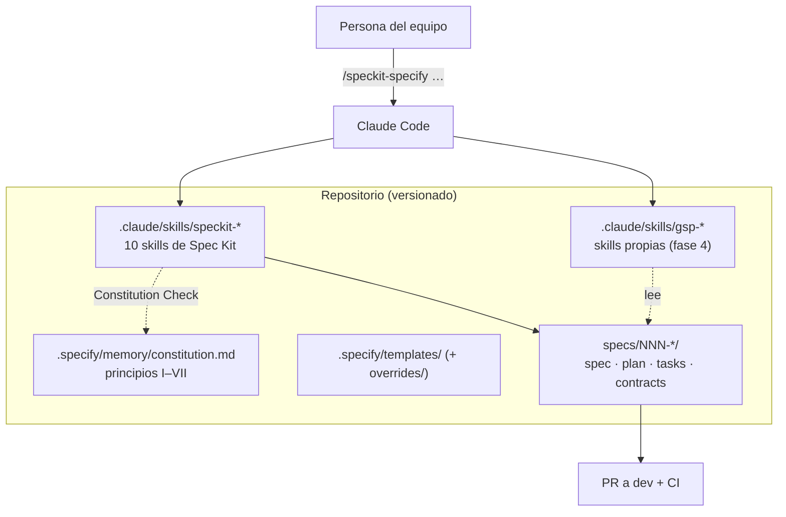

# Propuesta: adopción de Spec-Driven Development con Spec Kit + Skills

> **Proyecto:** Gestión de Servicios Profesionales · **Fecha:** 2026-09-11 · **Estado:** Aprobada para piloto
>
> **Relacionados:** [Guía de implementación](sdd-implementation.md) · [Guía de instalación](guia-instalacion-spec-kit.md) ·
> [Estado actual](estado-actual/ingenieria-inversa.md) · [Brechas](estado-actual/analisis-brechas.md)

---

## 1. Contexto y problema

El sistema lleva siete meses de desarrollo (277 commits y 104 PR integrados en `dev`) con un
proceso *code-first*: los requisitos viven en issues, en borradores fuera del repositorio
(`.github/DRAFTS/`, ignorado) y en un reporte de auditoría en Word. La
[ingeniería inversa](estado-actual/ingenieria-inversa.md) encontró:

- **Funciones anunciadas que no existen:** cotización (`Quote`) y verificación de
  profesionales (`Verification`) son tablas sin API, sin UI y sin pruebas.
- **Reglas de negocio implícitas e incompletas:** calificaciones sin validar estado ni
  propiedad; `AverageRating` sin actualizar.
- **Pruebas desbalanceadas:** 4 casos formales para 40 endpoints; cuatro módulos sin pruebas.
- **Documentación que diverge del código** (README con accesos y versiones incorrectos).
- **Reglas del equipo no versionadas** (`.CLAUDE/` ignorada por git).

## 2. Objetivo

Hacer que cada cambio relevante nazca de una especificación versionada, revisable y verificable,
de modo que requisitos, diseño, tareas, código y pruebas queden trazados entre sí, y que los
agentes de IA que ya usa el equipo (Claude Code) trabajen sobre esos artefactos y no sobre
suposiciones.

## 3. Alternativas evaluadas

| Criterio | **Kiro** (AWS) | **GitHub Spec Kit** | Seguir *code-first* |
|---|---|---|---|
| Qué es | Entorno de desarrollo agéntico propio (IDE/CLI de Kiro) con specs integrados | Toolkit de código abierto: CLI `specify`, plantillas, scripts y comandos/skills para agentes existentes | Proceso actual |
| Licencia y costo | Producto comercial con plan gratuito limitado y planes de pago; precios vigentes por validar en kiro.dev | MIT, sin costo de licencia; se paga solo el agente que ya se usa | Sin costo directo |
| Agente de IA | El de Kiro | Agnóstico: Claude Code, Copilot, Gemini, entre otros (`specify integration list`) | El que se use, sin estructura |
| Artefactos | `requirements.md` (historias con criterios en notación EARS), `design.md`, `tasks.md` | `constitution.md`, `spec.md`, `plan.md`, `research.md`, `data-model.md`, `contracts/`, `quickstart.md`, `tasks.md`, `checklists/` | Issues y código |
| Gobernanza del proyecto | *Steering files* en `.kiro/steering/` (`product.md`, `tech.md`, `structure.md`) con modos de inclusión | Constitución con versión semántica, *Constitution Check* en cada plan y validación en `analyze` | Reglas informales |
| Verificación de consistencia | Seguimiento de tareas en el IDE | `/speckit-analyze` (spec ↔ plan ↔ tareas ↔ constitución) y `/speckit-converge` (código ↔ artefactos) | Revisión manual |
| Automatización | *Agent hooks* por evento (guardar archivo, antes o después de una herramienta, al terminar una tarea) | Hooks de extensiones (`.specify/extensions.yml`), *workflows* con puertas de aprobación, presets | CI existente |
| Ejecución de tareas | Olas concurrentes de tareas independientes | `/speckit-implement` por orden de dependencias; marca `[P]` para paralelizables | Manual |
| Proyecto existente (brownfield) | Soportado | Guía oficial `existing-projects.md`; `specify init --here` sin tocar el código | — |
| Dependencia de proveedor (*lock-in*) | Alta: el flujo vive en el entorno de Kiro | Baja: todo es Markdown y scripts en el repo; se cambia de agente con `specify integration switch` | — |
| Encaje con este equipo | Obliga a cambiar de herramienta de trabajo | Se instala sobre el Claude Code que ya se usa; scripts PowerShell nativos para Windows | — |
| Madurez | Producto en evolución | v1.0.6 (2026-09-10); desde 1.0 prioriza adaptabilidad sobre estabilidad de la interfaz | — |

### Lectura de la comparación

- **Kiro** ofrece la experiencia más integrada (specs, hooks y ejecución en olas dentro del
  mismo entorno) y su notación EARS produce criterios muy precisos. A cambio, obliga a adoptar
  su entorno y su agente, y el costo depende del plan.
- **Spec Kit** ofrece más artefactos (en particular `contracts/`, `research.md` y `checklists/`),
  una gobernanza más formal (constitución versionada que bloquea planes) y no ata al equipo a un
  proveedor. Su debilidad es que depende de la disciplina del equipo y de la calidad del agente.
- **Seguir code-first** no resuelve ninguno de los síntomas de la sección 1.

## 4. Decisión

Se adopta **GitHub Spec Kit** con la integración de **Claude Code en modo skills**, por:

1. **Cero fricción:** el equipo ya trabaja con Claude Code; Spec Kit se instala encima.
2. **Artefactos en el repo:** specs, constitución y skills se versionan y revisan como código.
3. **Gobernanza formal:** la constitución convierte las reglas existentes en una puerta
   automática de cada plan.
4. **Sin costo de licencia ni *lock-in*.**
5. **Soporte de Windows/PowerShell,** que es el entorno del equipo.

De Kiro se toman dos ideas: escribir los criterios de aceptación con la disciplina de EARS
(*CUANDO … EL SISTEMA DEBE …*) dentro de los escenarios *Given/When/Then* de Spec Kit, y usar
hooks para automatizar pasos repetitivos (sección 5.3).

## 5. Propuesta SDD + Skills



### 5.1 Capa 1 — Skills de Spec Kit (instaladas)

`specify init --here --integration claude --script ps` instaló diez skills en
`.claude/skills/speckit-*/SKILL.md`: `constitution`, `specify`, `clarify`, `plan`,
`checklist`, `tasks`, `analyze`, `implement`, `converge` y `taskstoissues` (esta última
saldrá del núcleo en una versión futura, según las notas de la 1.0.5). Se invocan en Claude Code
como `/speckit-<comando>`.

### 5.2 Capa 2 — Constitución

[`.specify/memory/constitution.md`](../../.specify/memory/constitution.md) v1.1.0 cumple el papel
que en Kiro tienen los *steering files*: sus siete principios provienen de las reglas ya vigentes
y la versión 1.1.0 añade la excepción acotada para `driver.js` que requiere el piloto b).

### 5.3 Capa 3 — Skills propias del proyecto (propuestas para la fase 4)

Skills pequeñas que encapsulan conocimiento específico de este repositorio. **No están creadas;**
se proponen para después de los pilotos:

| Skill | Cuándo se usa | Qué hace |
|---|---|---|
| `gsp-ingenieria-inversa` | Al cerrar cada fase | Regenera el inventario de endpoints, el ER Mermaid y la matriz de trazabilidad a partir de `Controllers/`, `Models/`, `AppDbContext` y los tests |
| `gsp-backend-feature` | Durante `implement` en backend | Aplica el checklist de capas (Principio II), DTOs (III), migración (IV) y pruebas (V) a cada tarea |
| `gsp-e2e-mcp` | Piloto a) y siguientes | Guía la exploración con Playwright MCP y la conversión a specs `*.spec.ts` con `page.route` |
| `gsp-pr-sdd` | Al preparar un PR | Arma el cuerpo del PR con enlace al spec, tareas cerradas y resumen de `analyze` (sin crear el PR sin confirmación) |

Esqueleto de ejemplo:

```markdown
---
name: gsp-backend-feature
description: Checklist de capas, DTOs, migración y pruebas para tareas de backend de este repo.
---
Antes de marcar una tarea de backend como hecha, comprueba:
1. El controller solo mapea HTTP y no usa AppDbContext (constitución, Principio II).
2. Entrada y salida por DTOs de DTOs/<Módulo>/ (Principio III).
3. Cambios de esquema solo con `dotnet ef migrations add` (Principio IV).
4. Prueba unitaria en Unit/ y de integración en Integration/ (Principio V).
5. `dotnet tool run csharpier format backend/` sin cambios pendientes (Principio VI).
```

Complementos de Spec Kit que se evaluarán en la misma fase:

- **Overrides de plantillas** en `.specify/templates/overrides/` para tener `spec-template.md`
  y `plan-template.md` en español y con las rutas reales del repo.
- **Hooks de extensión** (`.specify/extensions.yml`), por ejemplo `after_tasks` para sugerir
  `/speckit-analyze` automáticamente.

## 6. Alcance del piloto

Los módulos piloto los eligió el responsable del proyecto. Son capacidades transversales, no
módulos de negocio:

| Piloto | Spec | Objetivo | Decisión clave |
|---|---|---|---|
| a) Pruebas automáticas | [`specs/001-e2e-playwright-mcp`](../../specs/001-e2e-playwright-mcp/spec.md) | Cubrir con E2E los flujos sin pruebas (catálogo, solicitudes, servicios del profesional) usando IA para explorar y generar pruebas | Playwright + Playwright MCP; Katalon, Selenium y Cypress se evalúan y descartan en `research.md` (Principio V) |
| b) Guía interactiva | [`specs/002-guia-interactiva-tours`](../../specs/002-guia-interactiva-tours/spec.md) | Tours de producto por rol para cliente, profesional y administrador | `driver.js` mediante enmienda acotada de la constitución (v1.1.0) |
| c) Software como infraestructura | [`specs/003-infraestructura-como-codigo`](../../specs/003-infraestructura-como-codigo/spec.md) | Entorno de desarrollo reproducible (Codespaces), infraestructura declarativa multi-nube (Terraform) y despliegue continuo verificado | Render como proveedor actual; un segundo proveedor como prueba de portabilidad; retoma los issues #131 y #189 |

**Fuera de alcance del piloto:** implementar el código (`/speckit-implement`), que se hará en
ramas `feat/` propias con aprobación explícita, y los módulos de negocio (fase 3).

## 7. Plan y esfuerzo estimado

| Fase | Entregable | Esfuerzo |
|---|---|---|
| 0 | Instalación, constitución | 0.5 días (hecho) |
| 1 | Ingeniería inversa y brechas | 1 día (hecho) |
| 2a | Artefactos de los 3 pilotos hasta `analyze` | 1.5 días (hecho) |
| 2b | Implementación de los pilotos (P1 de cada uno) | 2–3 semanas, según `tasks.md` |
| 3 | Specs de módulos de negocio | 1 semana |
| 4 | Institucionalización | 1 semana |

**Costo de licencias:** cero. **Costo de nube (piloto c):** planes gratuitos o de prueba de los
proveedores; el plan de Terraform no aplica recursos sin aprobación.

## 8. Criterios de éxito del piloto

1. Los tres pilotos llegan a `analyze` con **0 hallazgos CRITICAL** y 100 % de requisitos con tarea.
2. Al implementar P1 de cada piloto, `converge` agrega **menos de 3 tareas** no previstas.
3. Cada PR del piloto enlaza su spec y cita las tareas que cierra.
4. El equipo, en la retrospectiva, prefiere continuar con SDD para la fase 3.

## 9. Riesgos

| Riesgo | Probabilidad | Mitigación |
|---|---|---|
| El equipo percibe SDD como burocracia | Media | Pilotos acotados; specs solo para features, no para *fixes* triviales |
| Cambios de la herramienta (1.x) | Media | Versión fijada; `specify self upgrade --dry-run` antes de actualizar |
| Choque de reglas (como el de `driver.js`) | Baja | Enmiendas explícitas y versionadas en la constitución |
| Diferencia de mayúsculas `.CLAUDE`/`.claude` entre Windows y Linux | Resuelto | Carpeta renombrada a `.claude` y `.gitignore` ajustado ([guía §5](guia-instalacion-spec-kit.md#5-problema-encontrado-claude-y-claude-son-la-misma-carpeta-en-windows)) |
