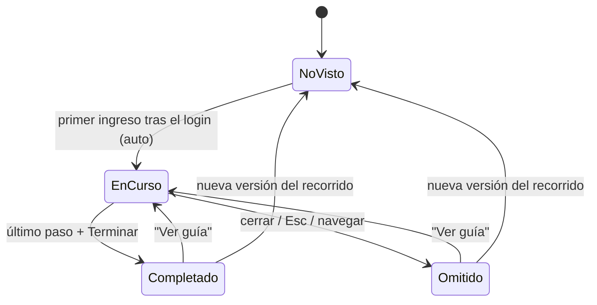

# Data Model: Guía interactiva de producto por rol

Todo el modelo vive en el frontend; no hay entidades nuevas en la base de datos.

## Entidades

### Tour (recorrido)

| Campo | Tipo | Reglas |
|---|---|---|
| `id` | `"cliente" \| "profesional" \| "admin"` | Único por rol |
| `role` | `TourRole` (`"client" \| "professional" \| "admin"`) | Resultado de `normalizeRole` |
| `version` | entero ≥ 1 | Se incrementa cuando cambian los pasos o sus textos |
| `steps` | `TourStep[]` | 1 a 7 pasos (SC-002) |

### TourStep (paso)

| Campo | Tipo | Reglas |
|---|---|---|
| `target` | texto | Valor de un atributo `data-tour` del [contrato](contracts/tour-ui-contract.md) |
| `title` | texto | 1 a 60 caracteres, en español |
| `description` | texto | 1 a 200 caracteres, en español (FR-004) |
| `side` | `"top" \| "bottom" \| "left" \| "right"` | Opcional; por defecto `bottom` |

### TourState (estado del recorrido)

| Campo | Tipo | Reglas |
|---|---|---|
| clave | `gsp-tour:<tourId>:v<version>:<usuario>` | `<usuario>` = correo en minúsculas de la sesión |
| `result` | `"completed" \| "dismissed"` | `completed` al pulsar "Terminar" en el último paso; `dismissed` al cerrar, pulsar Esc o navegar |
| `at` | ISO-8601 | Momento del registro |

## Transiciones

Regla de inicio automático: se inicia solo desde `NoVisto`, es decir, cuando no existe la clave de
la versión vigente para ese usuario.

## Catálogo inicial de pasos (versión 1)

| Recorrido | # | `target` | Título |
|---|---|---|---|
| cliente | 1 | `nav-catalogo` | Explora el catálogo |
| cliente | 2 | `catalogo-lista` | Servicios disponibles |
| cliente | 3 | `catalogo-tarjeta` | Abre un servicio para solicitarlo |
| cliente | 4 | `nav-solicitudes` | Sigue tus solicitudes |
| cliente | 5 | `nav-perfil` | Tu perfil |
| cliente | 6 | `nav-ver-guia` | Vuelve a ver esta guía cuando quieras |
| profesional | 1 | `nav-mis-servicios` | Publica y administra tus servicios |
| profesional | 2 | `servicio-formulario` | Crea un servicio |
| profesional | 3 | `servicio-lista` | Activa o desactiva tus servicios |
| profesional | 4 | `nav-solicitudes` | Atiende las solicitudes que recibes |
| profesional | 5 | `nav-perfil` | Tu perfil profesional |
| profesional | 6 | `nav-ver-guia` | Vuelve a ver esta guía cuando quieras |
| admin | 1 | `nav-administracion` | Administración de usuarios |
| admin | 2 | `usuarios-tabla` | Busca, edita o suspende usuarios |
| admin | 3 | `admin-bitacora` | Bitácora de acciones |
| admin | 4 | `admin-grafica` | Registros por fecha |
| admin | 5 | `admin-respaldos` | Respaldos de la base de datos |
| admin | 6 | `nav-ver-guia` | Vuelve a ver esta guía cuando quieras |

Las descripciones completas (≤ 200 caracteres) se redactan en `tours.catalog.ts` (T010–T012) y se
revisan en el checklist `ux.md`.
