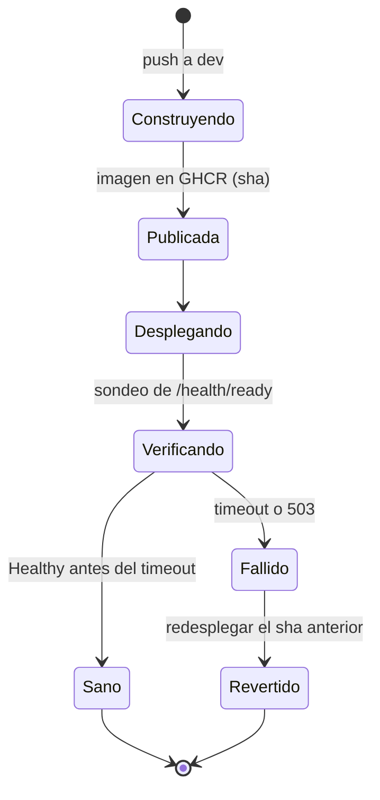

# Data Model: Software como infraestructura

## Ambientes

| Ambiente | Dónde corre | Quién lo crea | Aprobación | Datos |
|---|---|---|---|---|
| `codespace` | GitHub Codespaces (por persona) | La persona, desde el repo | No | Efímeros; base local `db` |
| `staging` | Render (API, frontend, PostgreSQL) | Terraform (`infra/envs/staging`) | `infra-apply` y despliegues automáticos | De prueba; base protegida contra borrado |
| `production` | Render (actual, manual) | Fuera de alcance (se importará después) | Revisión obligatoria para promover | Reales |

## Inventario de configuración y secretos

Fuente: `.env.example`, `docker-compose.yml` y `docker-image.yml`.

| Variable | Sensible | Codespace | Staging (Render) | Origen del valor |
|---|:--:|---|---|---|
| `DB_HOST`, `DB_PORT`, `DB_NAME`, `DB_USER` | No | `db`, 5432, fijos | Salidas de `render_postgres` | Terraform |
| `DB_PASSWORD` | **Sí** | Fija, local | Salida de `render_postgres` | Terraform (sensible) |
| `JWT_KEY` | **Sí** | Secreto de Codespaces | Env group | GitHub Secret → variable sensible de Terraform |
| `JWT_ISSUER`, `JWT_AUDIENCE`, `JWT_EXPIRES_MINUTES` | No | Por defecto | Env group | `terraform.tfvars` |
| `SMTP_HOST`, `SMTP_PORT`, `SMTP_FROM` | No | Secreto de Codespaces | Env group | GitHub Secret |
| `SMTP_USER`, `SMTP_PASSWORD` | **Sí** | Secreto de Codespaces | Env group | GitHub Secret |
| `ALLOWED_ORIGINS` | No | URL reenviada del puerto 3000 | URL del frontend de staging | Calculado |
| `NEXT_PUBLIC_ALLOWED_PATH` | No | URL reenviada del puerto 5000 | URL de la API de staging | Calculado |
| `FORWARDED_LIMIT` | No | 1 | 2 (Cloudflare + Render) | `terraform.tfvars` |
| `FILE_STORAGE`, `BACKUP_DIR`, `OTEL_EXPORTER_OTLP_ENDPOINT` | No | Vacíos | Vacíos o de staging | `terraform.tfvars` |

Secretos de la plataforma de CI (nunca llegan a la aplicación):

| Secreto | Alcance | Uso |
|---|---|---|
| `TF_API_TOKEN` | Environment `infra` | Estado remoto de HCP Terraform |
| `RENDER_API_KEY`, `RENDER_OWNER_ID` | Environments `infra` y `staging` | Proveedor de Render y despliegue |
| `GH_ADMIN_TOKEN` | Environment `infra` | Proveedor de GitHub (ambientes y secretos) |
| `GITHUB_TOKEN` | Automático | Publicar la imagen en GHCR |

## Despliegue

| Campo | Descripción |
|---|---|
| `sha` | Commit de `dev` que originó la imagen |
| `image` | `ghcr.io/<owner>/gsp-api:<sha>` |
| `environment` | `staging` o `production` |
| `result` | `healthy`, `failed` o `rolled_back` |
| `verified_at` | Momento en que `/health/ready` respondió `Healthy` |

## Estado de infraestructura

- Workspace de HCP Terraform `gsp-staging`, con bloqueo y ejecución local (el plan corre en
  GitHub Actions y el estado vive en HCP).
- `render_postgres` con `lifecycle { prevent_destroy = true }` (FR-007).
