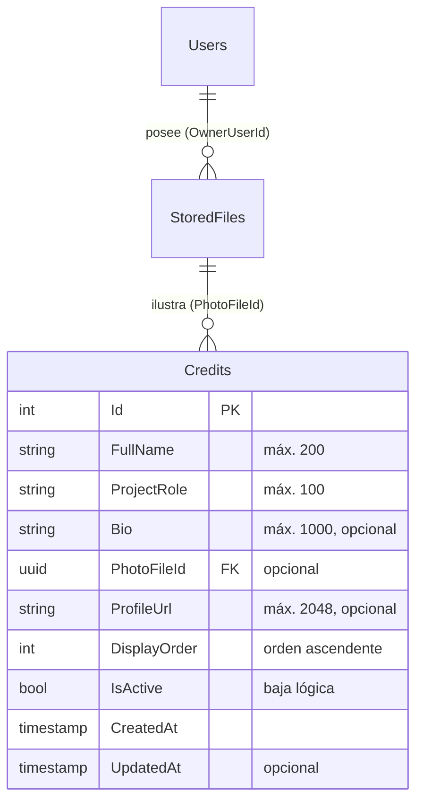
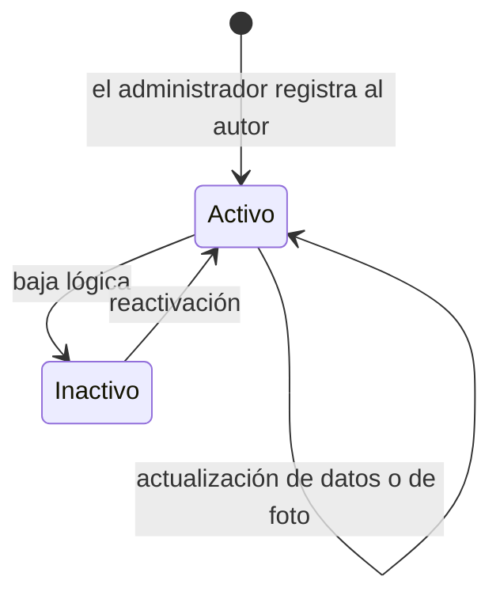

# Modelo de datos — Spec 007, módulo de créditos de autores

> Complementa el [modelo de datos actual](../../docs/sdd/estado-actual/er-diagram.md). Motor:
> PostgreSQL. Nombre de tabla = nombre del conjunto de entidades, por convención del ORM.

---

## 1. Entidad nueva

### `Credits`

| Campo | Tipo | Restricciones | Notas |
|---|---|---|---|
| `Id` | `int` | PK, autogenerado | Identificador entero, consistente con Categories, Services y Requests |
| `FullName` | `string` | Requerido, máx. 200 | Nombre completo del autor |
| `ProjectRole` | `string` | Requerido, máx. 100 | Rol en el proyecto, texto libre. No se relaciona con el enumerado `UserRole` |
| `Bio` | `string` | Opcional, máx. 1000 | Semblanza breve |
| `PhotoFileId` | `uuid` | Opcional, FK → `StoredFiles.Id` | Nulo cuando el autor no tiene foto |
| `ProfileUrl` | `string` | Opcional, máx. 2048 | Enlace público (perfil profesional, portafolio) |
| `DisplayOrder` | `int` | Requerido, por defecto 0 | Orden de presentación ascendente |
| `IsActive` | `bool` | Requerido, por defecto `true` | Baja lógica |
| `CreatedAt` | `timestamp` | Requerido | |
| `UpdatedAt` | `timestamp` | Opcional | |

**El campo `ProjectRole` es texto libre a propósito.** Un enumerado obligaría a migrar cada vez que
alguien cumple una función distinta, y el valor solo se muestra, nunca se usa para decidir nada.

## 2. Relaciones

**`Credits` no tiene relación con `Users`.** Un autor del sistema no es necesariamente un usuario
registrado. La relación con `Users` que aparece en el diagrama es la que ya existe entre
`StoredFiles` y su propietario, y el propietario es el administrador que subió la imagen, no el
autor retratado. Esta distinción debe quedar clara en el código: confundirla llevaría a suponer que
cada autor tiene cuenta en el sistema.

## 3. Comportamiento al borrar

| Relación | Clave foránea | Regla | Por qué |
|---|---|---|---|
| `Credits` → `StoredFiles` | `PhotoFileId` | **Restrict**, declarada explícitamente | Evita que borrar un archivo deje registros apuntando a nada. La clave es opcional, así que la convención del ORM aplicaría `SetNull`; se declara Restrict de forma explícita para que el borrado de un archivo referenciado falle de manera visible en lugar de vaciar el campo en silencio |

Este módulo **no participa de la cadena de borrado en cascada** señalada como riesgo latente en el
modelo actual: no cuelga de Categories ni de Services.

## 4. Índices

| Índice | Motivo |
|---|---|
| `(IsActive, DisplayOrder)` | La consulta pública filtra por activos y ordena por presentación; es el único camino de lectura del módulo |
| `PhotoFileId` | Índice por clave foránea, aplicado por convención del ORM |

**No se declara índice parcial** sobre `IsActive`, a diferencia del que existe en `Users`. La tabla
se mantendrá en el orden de decenas de filas, volumen en el que el planificador hará recorrido
secuencial de todos modos y el índice solo agregaría costo de escritura. Si la tabla creciera de
forma imprevista, el criterio se reevalúa.

## 5. Validaciones

| Campo | Regla | Dónde se aplica |
|---|---|---|
| `FullName` | No vacío tras recortar espacios; máx. 200 | Anotación en el modelo y validación en el servicio |
| `ProjectRole` | No vacío tras recortar espacios; máx. 100 | Igual |
| `Bio` | Máx. 1000 | Anotación |
| `ProfileUrl` | Máx. 2048; si viene, debe ser una dirección absoluta con esquema seguro | Validación en el servicio |
| `DisplayOrder` | Entero no negativo | Validación en el servicio |
| `PhotoFileId` | Si viene, debe existir en el almacén de archivos | Validación en el servicio antes de persistir |

**La validación de la dirección es deliberada:** el campo se renderiza como enlace en una página
pública. Aceptar esquemas arbitrarios abriría un vector de inyección en el consumidor.

## 6. Ciclo de vida

No hay estados intermedios ni transiciones condicionadas. Un autor inactivo conserva su registro,
su orden y su fotografía.

## 7. Configuración asociada

El título y el mensaje del equipo no se persisten. Viven en la configuración de la aplicación bajo
una sección propia, con los valores por defecto en el archivo de configuración base y sin
necesidad de variables sensibles.

| Clave | Tipo | Obligatoria | Comportamiento si falta |
|---|---|---|---|
| `Credits:Title` | texto | No | Se usa un valor por defecto |
| `Credits:Message` | texto | No | Se devuelve vacío; la consulta sigue respondiendo con éxito |

Ninguna de las dos es sensible, por lo que no se agregan al inventario de secretos.

## 8. Migración

Una sola migración, generada con la herramienta del ORM según la regla vigente del proyecto. Crea
la tabla y sus índices. **No incluye datos iniciales:** sembrar autores en la migración mezclaría
esquema y contenido, y el contenido se carga por los recursos de administración.
