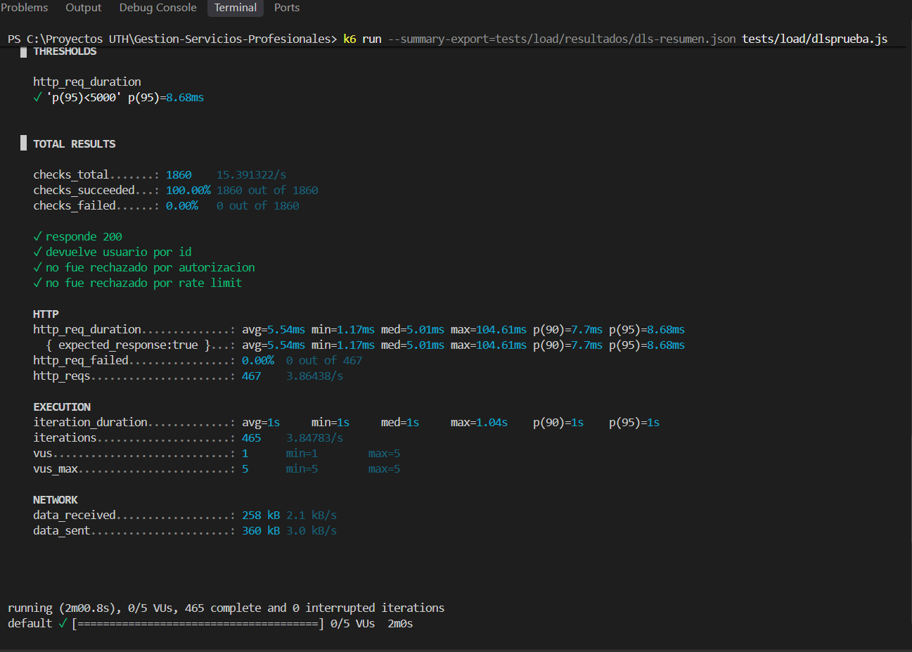

# Resultados de Prueba de Carga – Demian Leonardo Soto

- **Endpoint evaluado:** `GET /api/Users/{id}`
- **Archivo de prueba:** `tests/load/dlsprueba.js`
- **Usuarios virtuales máximos (VUs):** 5
- **Duración total:** 2m 00s (etapas: 30s rampa, 1m carga sostenida, 30s descenso)
- **Umbral definido:** p(95) < 5000 ms

## Métricas Clave

| Métrica | Valor obtenido | Estado / Criterio |
| :--- | :--- | :--- |
| **Peticiones totales** | 467 | Ejecutadas satisfactoriamente |
| **Tasa de error (fallos)** | 0.00% (0 de 467) | Excelente (0%) |
| **Checks exitosos** | 100.00% (1860 / 1860) | Aprobado |
| **Duración promedio (avg)**| 5.54 ms | Muy rápido |
| **Mediana (med)** | 5.01 ms | Estable |
| **Percentil 90 (p90)** | 7.70 ms | Estable |
| **Percentil 95 (p95)** | 8.68 ms | Cumple umbral (< 5000 ms) |
| **Tiempo mínimo (min)** | 1.17 ms | - |
| **Tiempo máximo (max)** | 104.61 ms | - |

## Conclusión
El endpoint responde de forma óptima bajo la concurrencia definida para el nivel de servicio acordado, manteniendo latencias inferiores a 10 ms en el 95% de las solicitudes y sin registrar rechazos por autenticación ni saturación por rate limit.

## Evidencia

